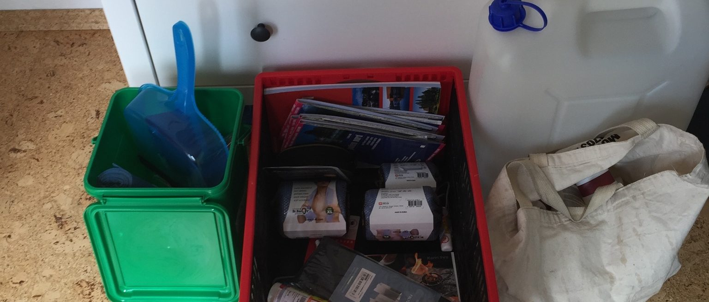

Es geht bald los! Man glaubt es kaum, da man ja nicht wirklich was von uns
hört, aber wir sind eifrig dabei unser Gefährt bereit zu machen!
Ines und Christian haben sich gestern Schlafsäcke gekauft, natürlich
kombinierbare. Wir waren wieder mal im Baumarkt um noch Kleinigkeiten  für den
Innenausbau zu kaufen und wir sind noch damit beschäftigt zu entscheiden wie
wir denn jetzt final schlafen.
Die Optionen sind:

* Alle im freien
* Jan im freien, Ines und Christian im Auto
* Jan im Auto, Ines und Christian in einem Autodachzelt

Ja das sind schwere Fragen, denn während der Rally soll es extra Punkte dafür
geben, wenn man campt und nicht im Auto oder Haus schläft (Wir haben nur gerade
Probleme den Paragraphen wieder zu finden).

Bis zum nächsten mal,

Jan
