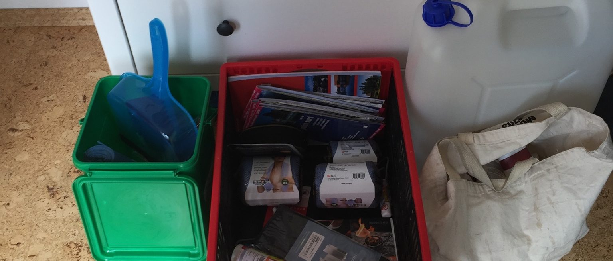

It’s getting closer! It’s difficult to imagine but we are eagerly preparing our
vehicle. We just are reaaaally quite about it.
Ines and Christian got new sleeping bags, obviously the combinable kind. We
were in the hardware store (again) to get some more stuff for the interior of
the car and we are still undecided how we gonna deal with the sleeping
situation. The options are:

* Every one camps.
* Jan camps, Ines und Christian sleep in the car.
* Jan in the car, Ines und Christian in a roof top tent.

It’s quite a hard question, you’ll get awarded extra points for camping and
avoiding houses or sleeping in cars (we are just not sure anymore where we read
it, so we aren’t really sure about it).

Until next time,

Jan
