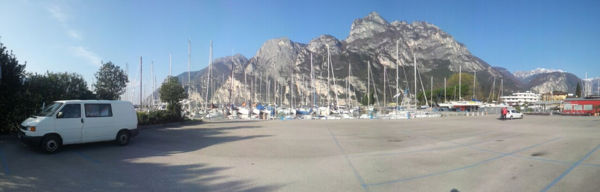
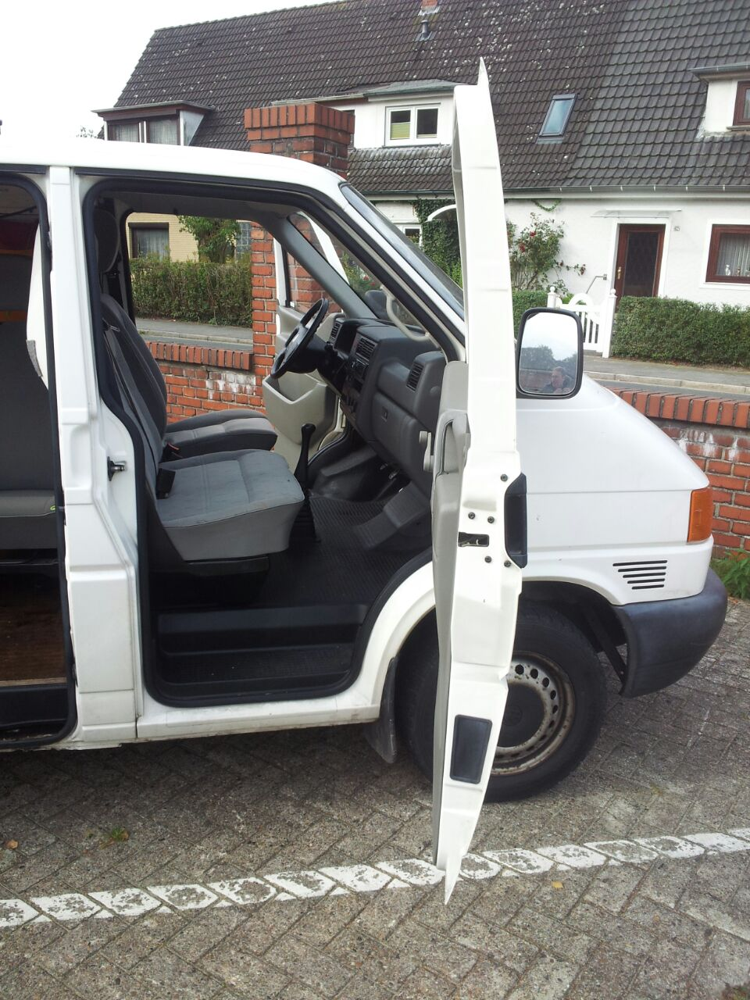
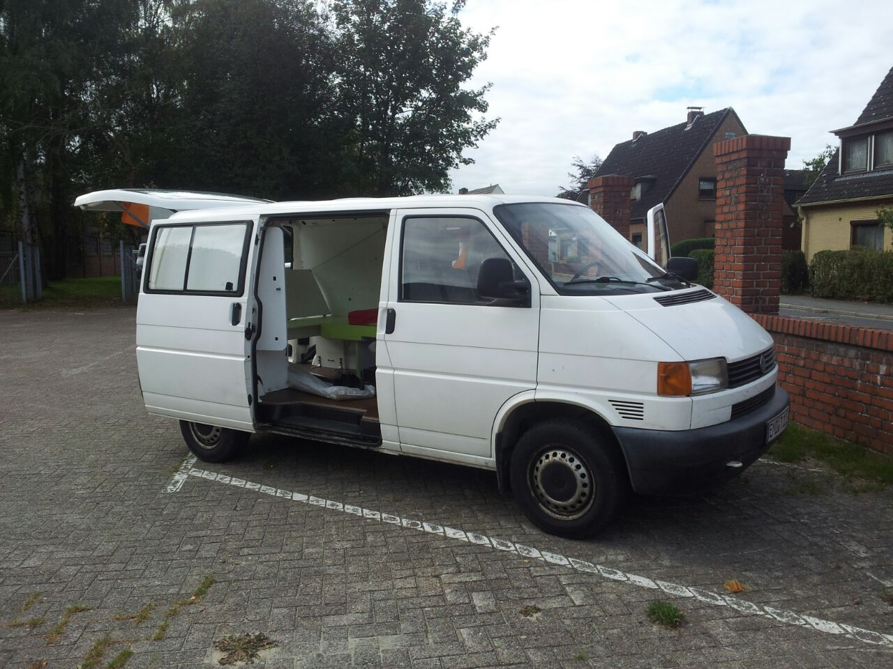

Ihr habt es wahrscheinlich schon an unserem Logo erahnt, aber um ehrlich zu
sein waren wir uns bis letzte Woche noch nicht sicher mit welchem fahrbaren
Untersatz wir antreten werden.
Wir haben uns nun entschieden unser Maskottchen zu fahren, einen weißen VW Bus
T4.

# Das Gute
Ines und Christian haben ihn kürzlich schon auf langer Strecke auf die Probe
gestellt und sind zum Gardasee und zurück mit ihm gefahren. Er hat auch schon
einen Platz in unserer Familie und wird Bob genannt. Er ist geräumig und bietet
zwei Personen einen bequemen Schlafplatz. Außerdem hat er genug Platz für
unsere Ausrüstung und Verpflegung.

# Der Nachteil
Hab ich nicht schon anfangs erwähnt, dass wir uns bis letzte Woche nicht sicher
waren, ob wir wirklich mit Bob fahren wollen? Das lag größtenteils daran, dass
er nur eine Sitzreihe hat. Das bedeutet, dass wir die zwei Wochen auf der
Straße alle zusammen auf den Vordersitzen verbringen. Wir stellen es uns sehr
gemütlich vor.

# Das Unattraktive
Er ist überhaupt nicht unattraktiv! Er ist eine wunderbare Box aus Stahl auf
vier Rädern! Wie dem auch sei, der Plan ist das ganze Ding noch ein bisschen
aufzuhübschen und den komplett weißen Look abzulegen. Von den Veranstaltern
gibt es Aufkleber mit unserer Startnummer und dem Veranstaltungslogo. Wir
werden ihn aber auch von Innen mit ein wenig Komfort ausstatten wie zum
Beispiel einem Mülleimer! Ihr könnt euch jedenfalls sicher sein, dass wir euch
über jeden Fortschritt auf dem Laufenden halten.
Bis zum nächsten mal,
Jan

