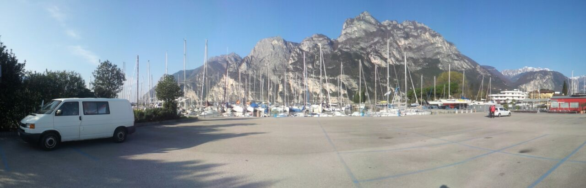
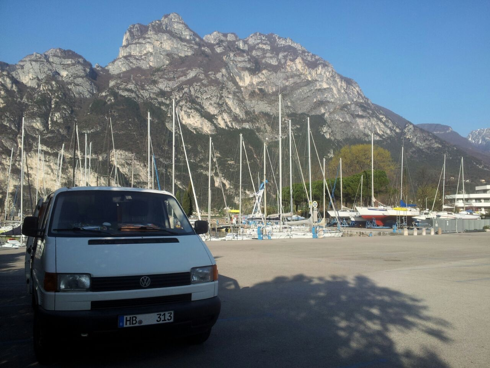
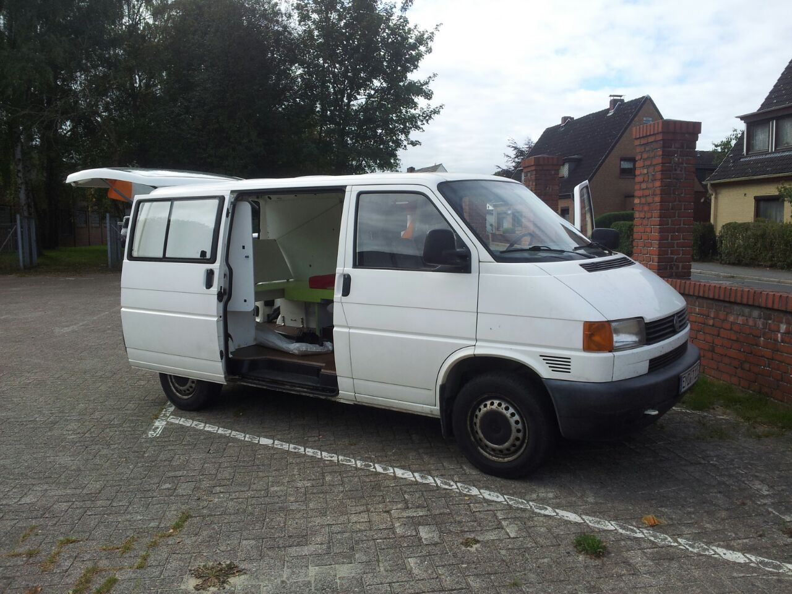

You probably guessed it from the Logo but to be honest we weren’t sure until
last weekend what our vehicle would be.
We finally decided to drive our mascot, a white Volkswagen T4.

# The Good
Ines and Christian just recently had a long distance test drive with him to
Lake Garda and back. He already has a place in our family and is called Bob. He
is spacious and can comfortably sleep two people inside while also storing our
equipment and supplies.

# The Bad
Didn’t I say in the beginning that we weren’t sure until last week if we really
gonna go with Bob? Well, he only has one row of seats. For two weeks we’ll sit
all together in the front row. We imagine it will be indeed quite cozy.

# The Ugly
Well, he isn’t ugly! He’s a precious steel box on wheels! However, the plans
still include a few things on how to spice him up and get rid of the all-white
look. We will get merchandise for the race that we will stick on Bob. We want
to add a bit of convenience to the interior like a trash bin! You can be sure
that we will update you on the progress.

Until next time,

Jan

