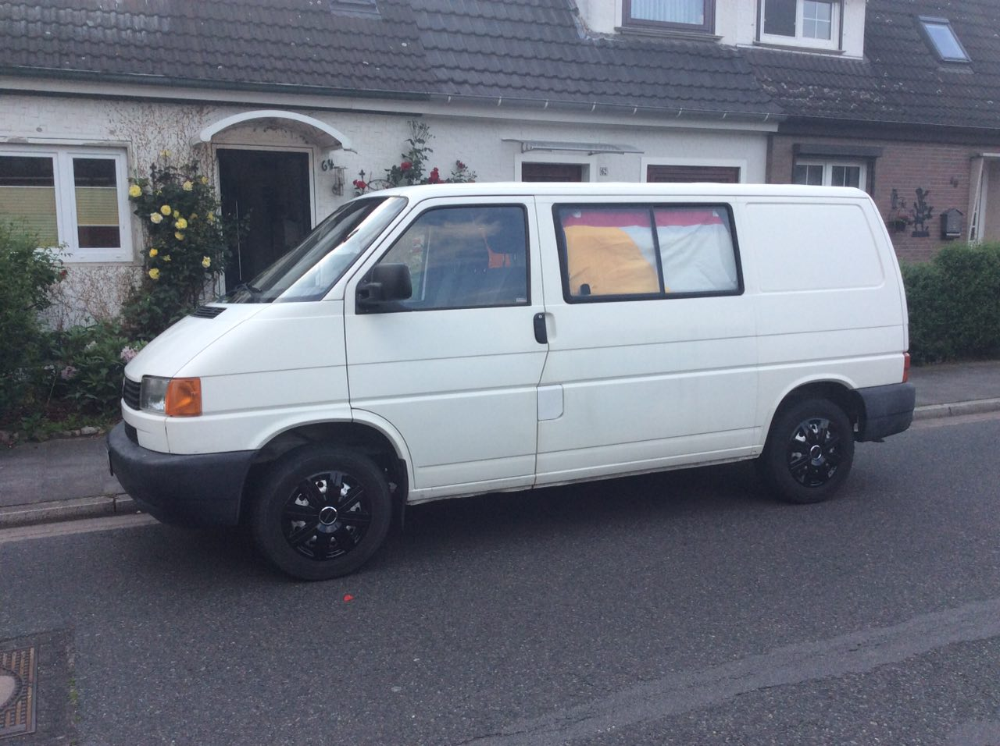
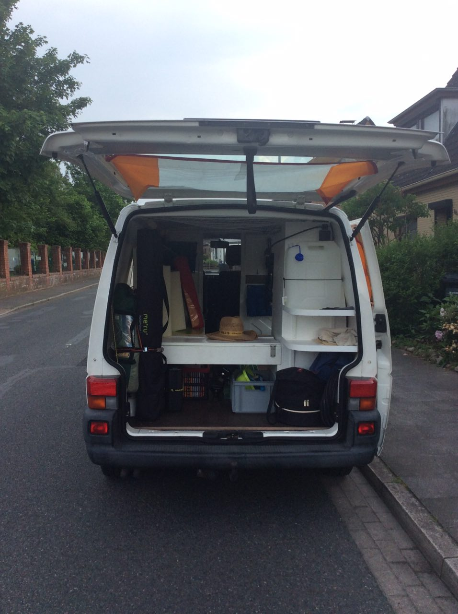
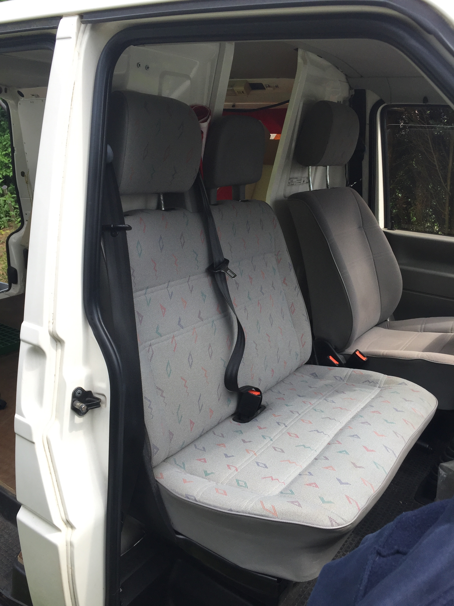
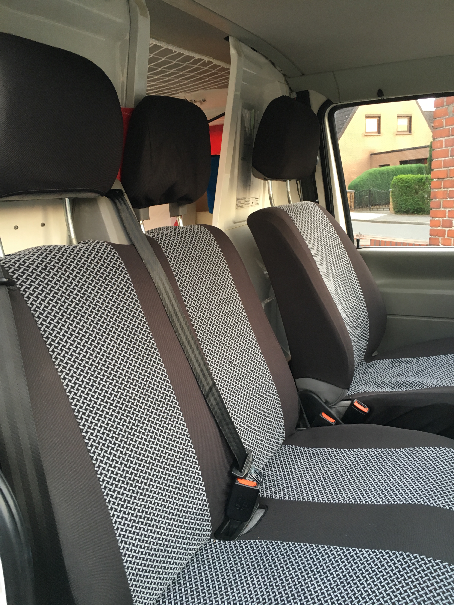
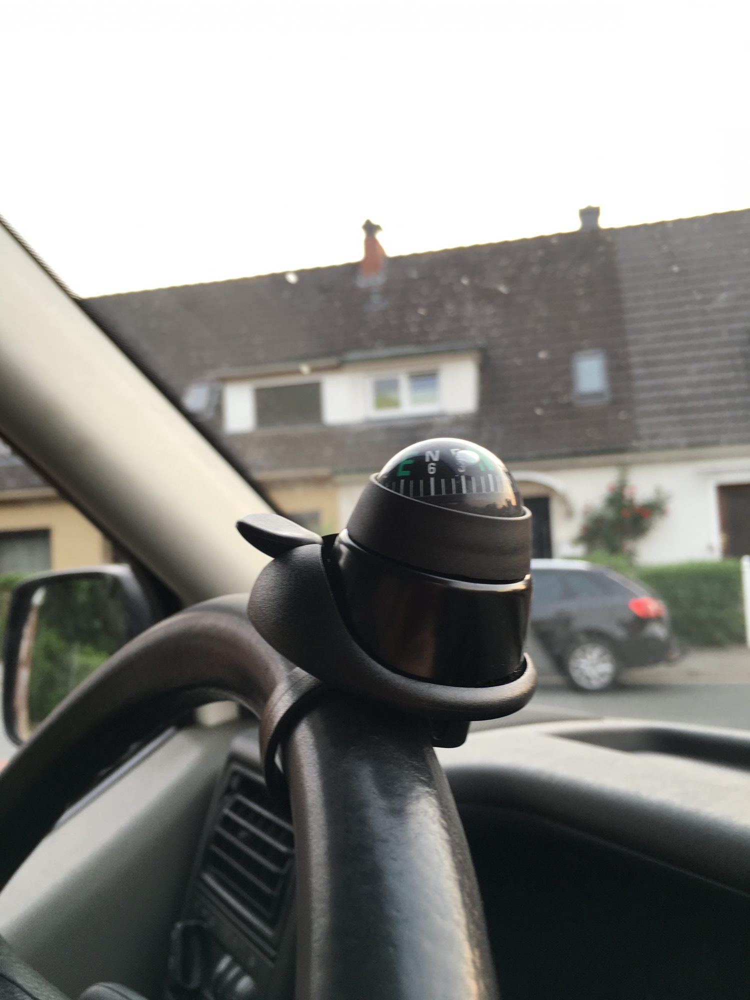
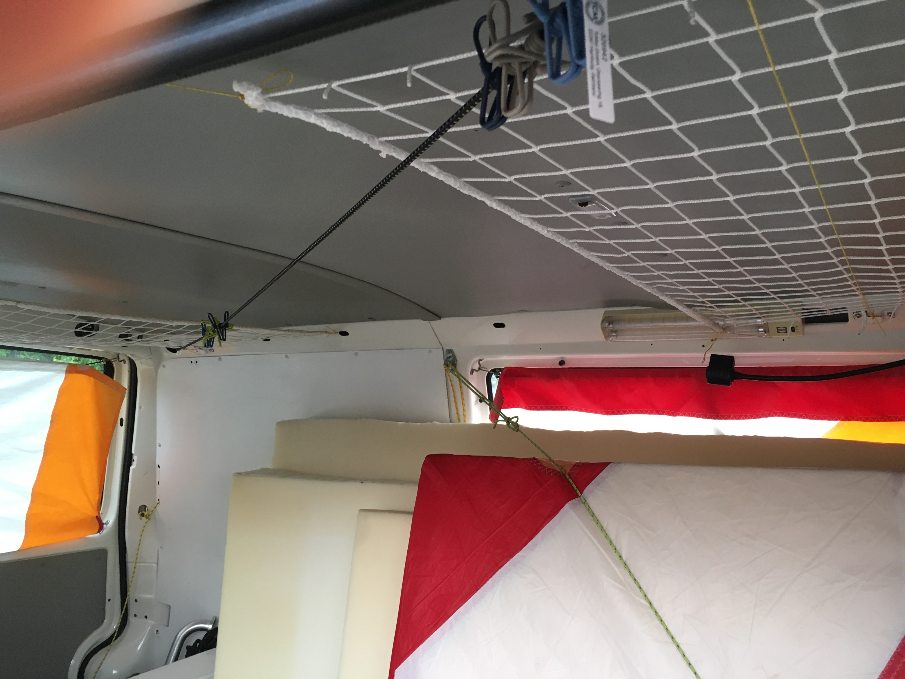
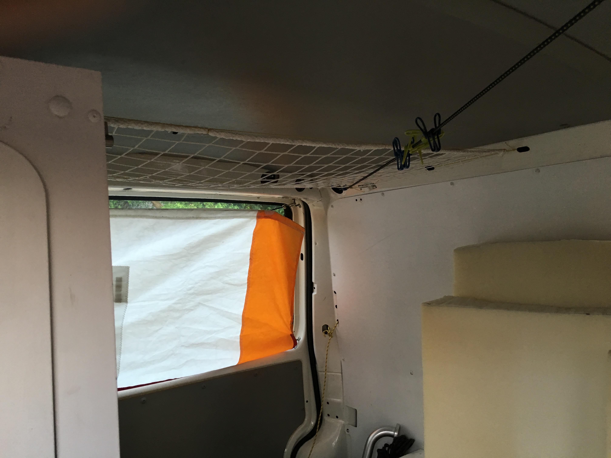

Es ist schon einiges passiert, um Bob für die Fahrt vorzubereiten. Es gibt
einige Bilder von verschiedenen Abschnitten, die wir euch natürlich nicht
vorenthalten wollen.

Er hat neue Radkappen bekommen:

neue Haltepunkte für den Grill (unten rechts):

Neue Sitzpolster (vorher -> nachher):
 

und es hat sich einiges im Innenraum getan:

unser Kompass

eine neue Wäscheleine

Netze unter der Decke als extra Stauraum

Taschen an der Rückwand des Cockpits

Wir arbeiten momentan immer noch an den Logos für die Außen-Deko. Magnetfolie
zu schneiden erweist sich um einiges ungemütlicher als Erwartet.
Das war’s auch schon an Updates zum Auto heute.

Bis zum nächsten mal,

Jan
