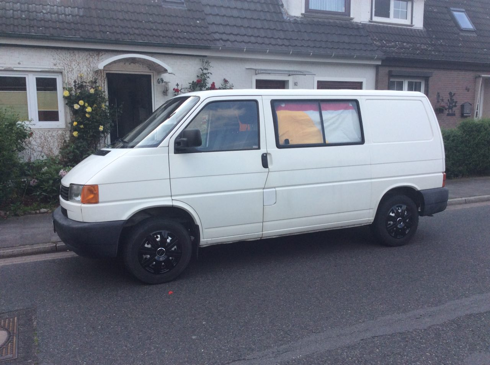
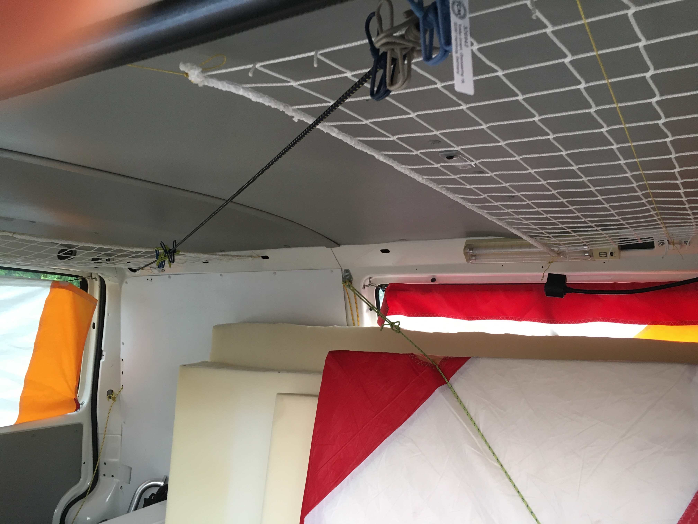
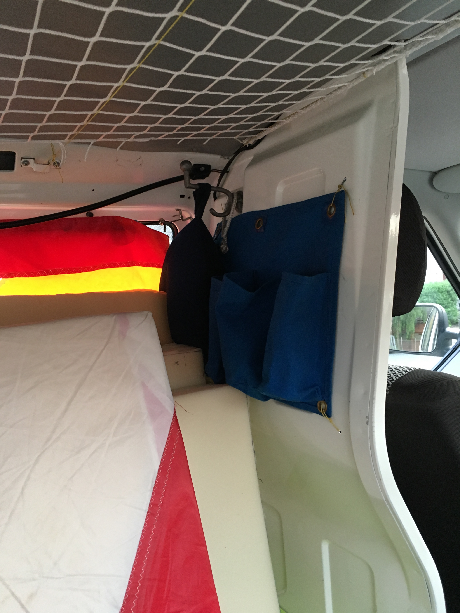

A few things happened with Bob as a preparation for the tour. We took a few
pictures to show you.

He got new hub cabs:

new hold points to secure the barbecue (lower right):

new seat covers (new <- old):
 

and a few things changed in the back:

our compass

A new clothesline

nets for more storage

pockets at the back of the cockpit

We are currently still working on cutting the logos for decorating the outside
of the bus. Magnetic foil is really quite something to cut.
That wraps the updates that we have for you so far.
See you soon,

Jan
