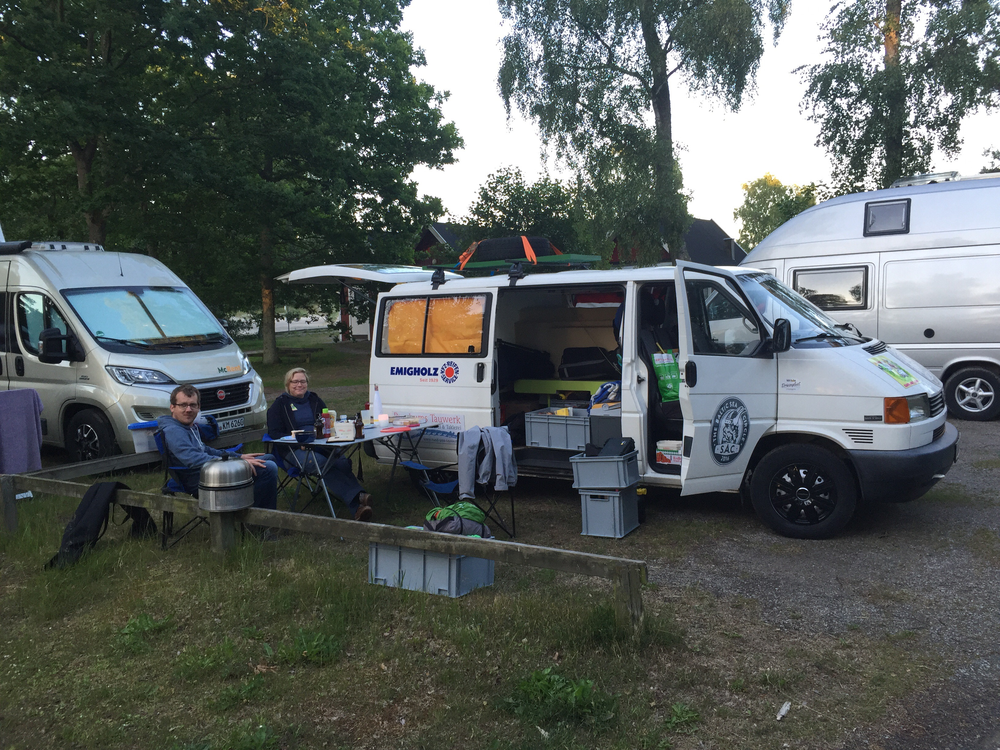
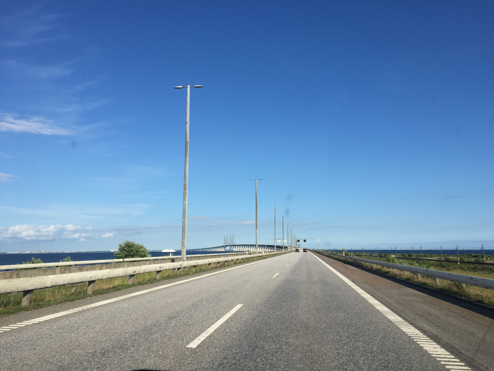
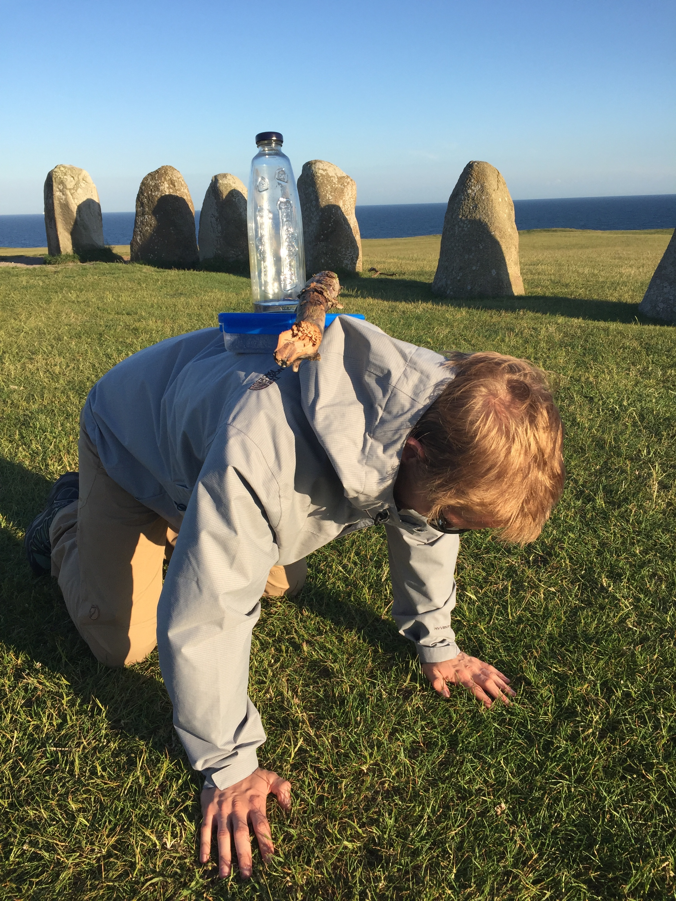

Tired but happy we dropped into our beds! The first day is done.
We started with exactly 200 teams on the fish market in Hamburg. First we made
ourselves familiar with the route and the daily challenge while we started on
the highway towards the north. on the first and last day it is allowed to use
the highway, for the remaining days we gotta take the nationals and side
roads.

One of the highlights was the øresund crossing from Denmark to Sweden. It
starts out as a tunnel before it emerges from the waves and covers the vast
majority of the distance as the actual bridge.
All in all the trip via Kolping and Copenhagen went according to our plan and
nothing happened so we managed to get to the finish line without any
problems.

The challenge was a viking consecration for the entire team. That meant for us
to collect Danish sand, Swedish wood, baltic water and wind. It promises a
better standing with the gods and Odin will be in our favor now!
If you didn’t donate yet head over to our donation page! 🙂 Die Arche and Serve
the City are thankful for every little support!
Regards, Ines, Christian and Jan
