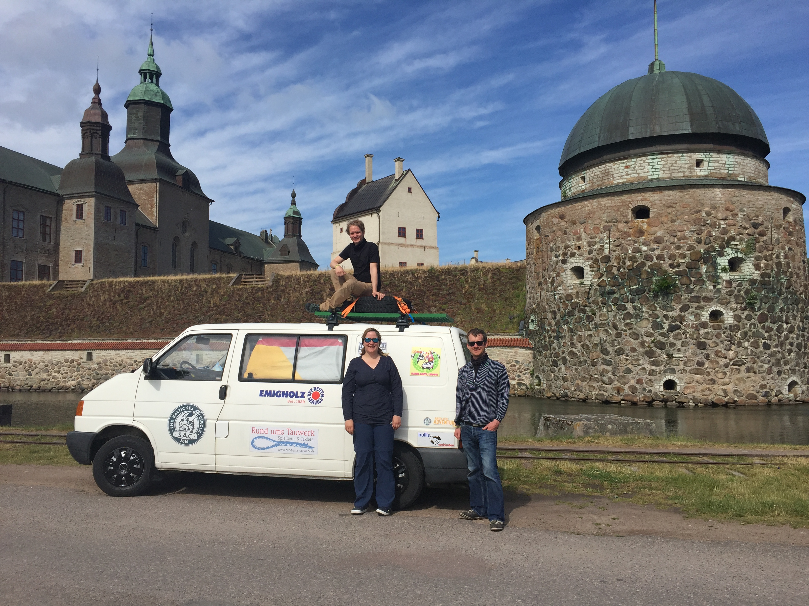
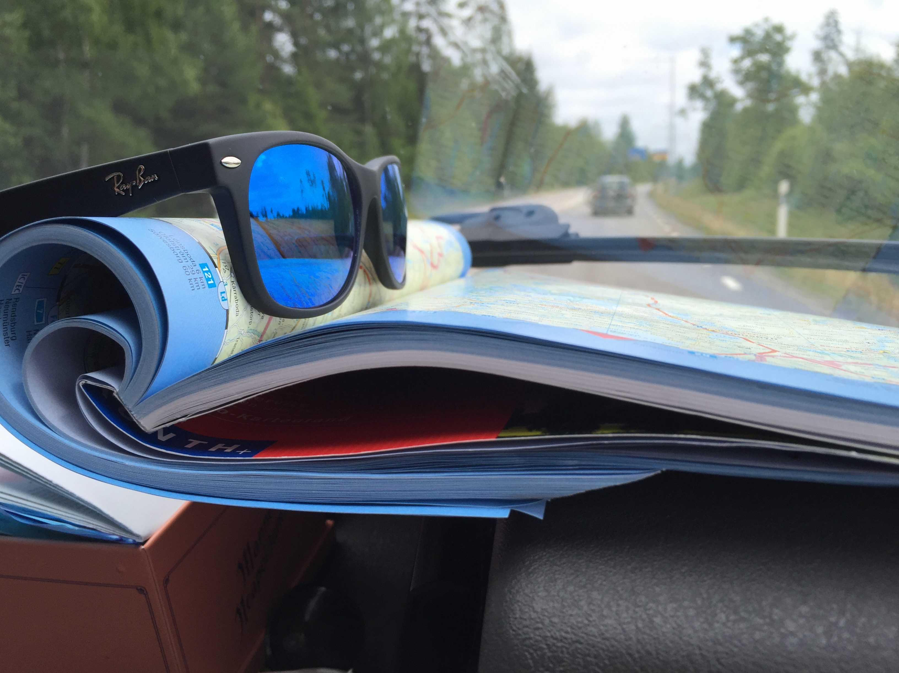
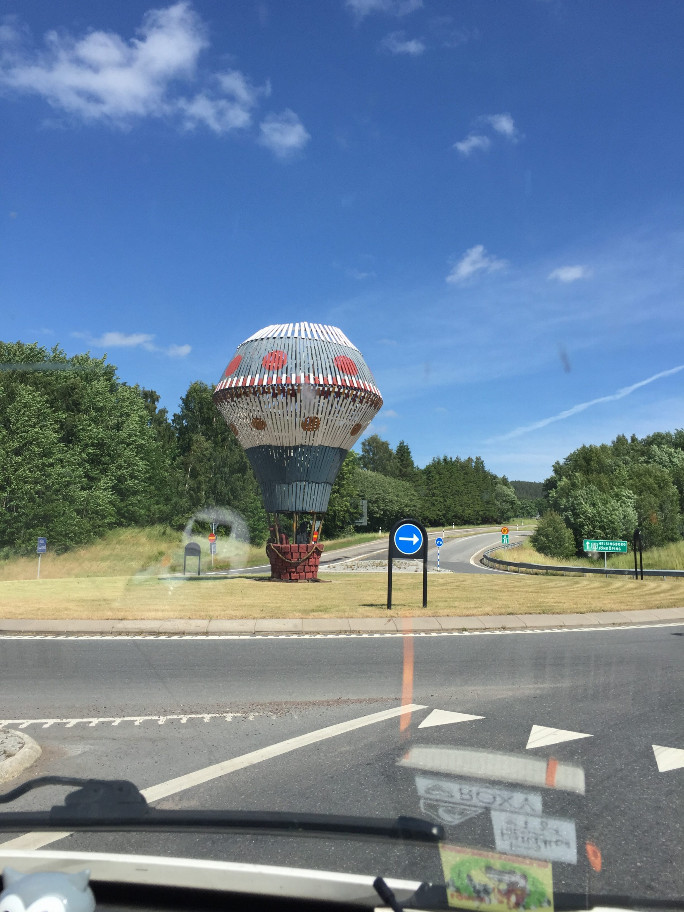
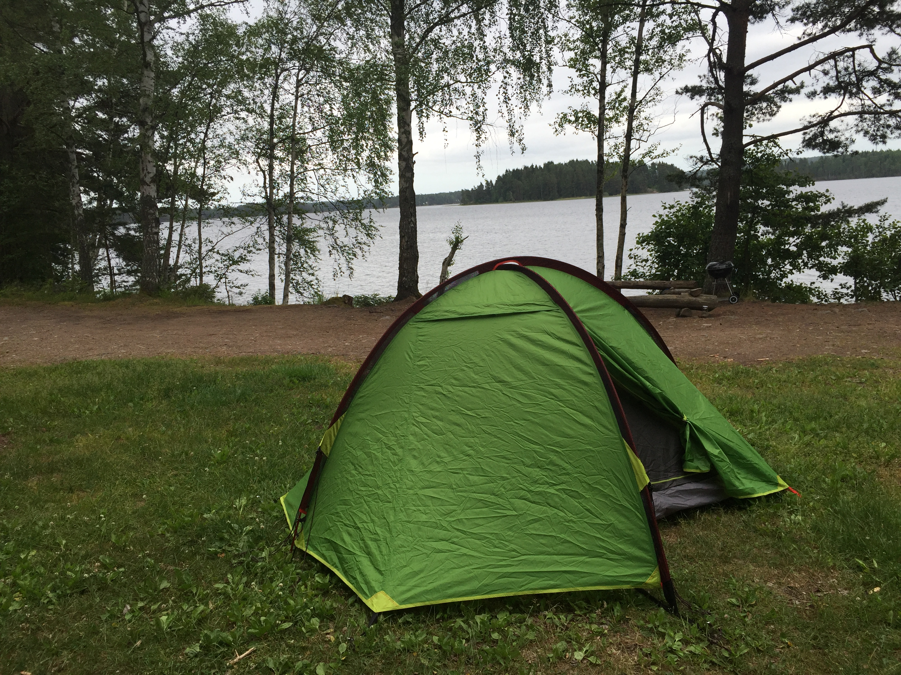

Der zweite Tag begonn um einiges früher als unser Aufbruch aus Hamburg und
damit hatten wir auch mehr Zeit die Kilometer hinter uns zu bringen. Zwischen 7
und 8 sind wir heute morgen zusammen mit einer recht großen Gruppe in
Sandhammaren abgebrochen mit dem Ziel an Jönköping vorbei zu kommen und entlang
der Küste des Vättern gen Norden zu kommen.

Auf der Suche nach der größten Erhebung der Umgebung brachte es uns zum Omberg
und wir lernten, dass es im Jahre 1897 eine nicht erfolgreich Polar Expedition
gab. Leider ist das Team mit ihrem Heißluftballon abgestürzt.

Heute Abend haben wir uns ein ruhiges Plätzchen abseits der Strecke an einem
See gesucht. Ein netter Schwede, den wir zunächst gefragt hatten, ob wir auf
seinem Grundstück die Nacht verbringen dürfen hat uns auf diesen wunderschönen
Platz hingewiesen.

Die nächsten zwei Tage werden ein bisschen anstrengend, da wir einiges an
Strecke schaffen müssen, um rechtzeitig zur Party auf den Lofoten zu sein.
Hoffentlich schaffen wir es dennoch euch über Neuigkeiten zu berichten!
In der Zwischenzeit könnt ihr gerne im Menü auf die Spendenseite gehen und
unsere Partner von der Arche oder Serve the City mit ein paar Talern
unterstützen.

Gruß und bis zum nächsten mal,

Jan
