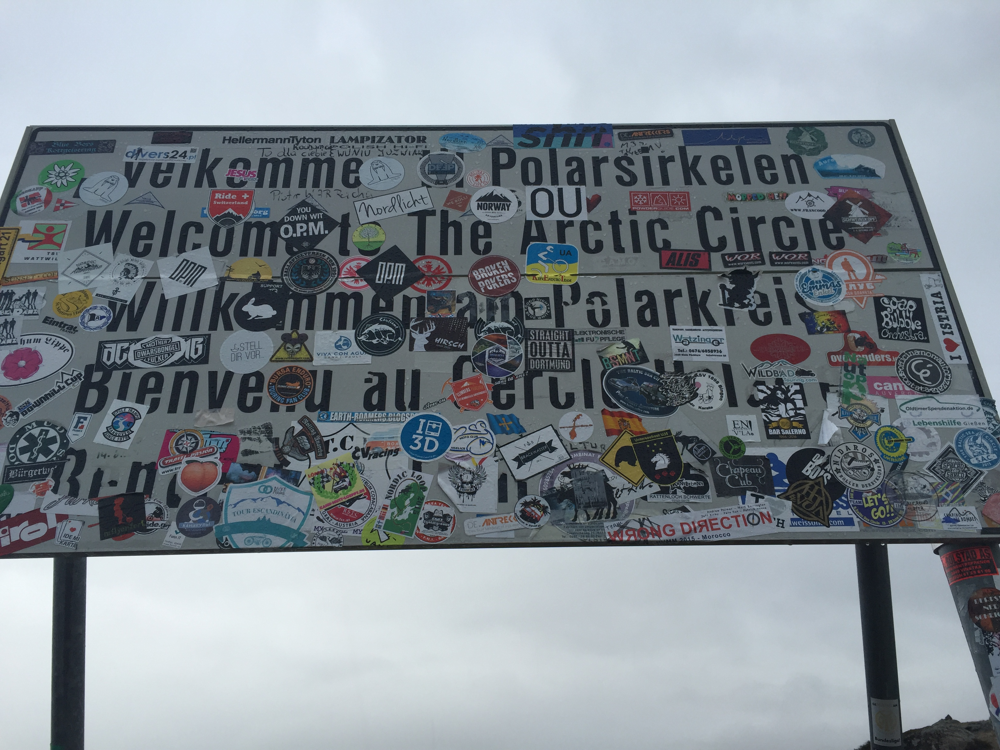
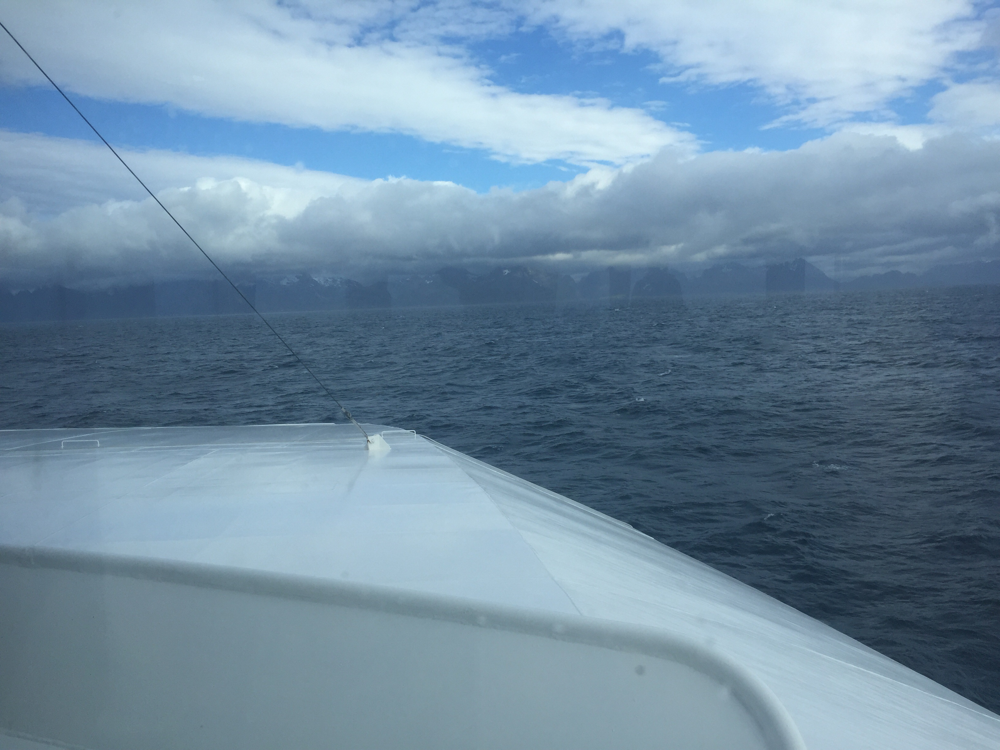
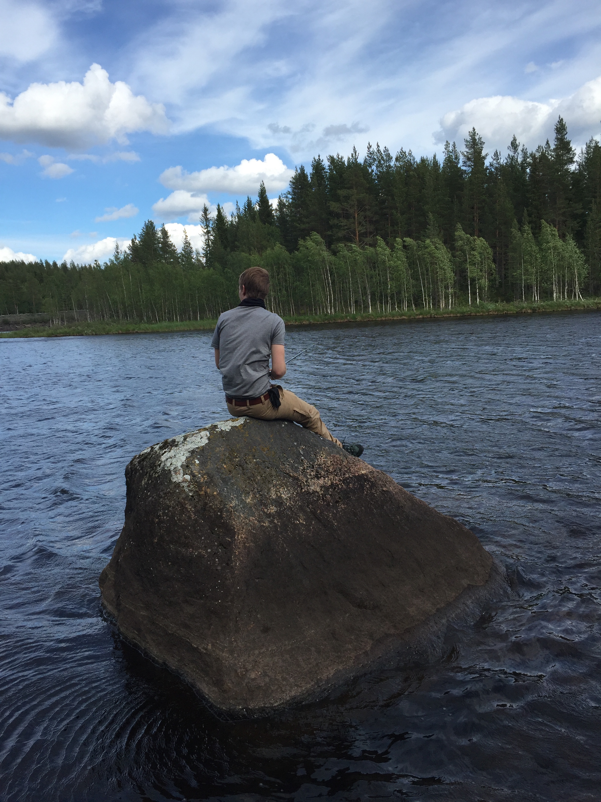
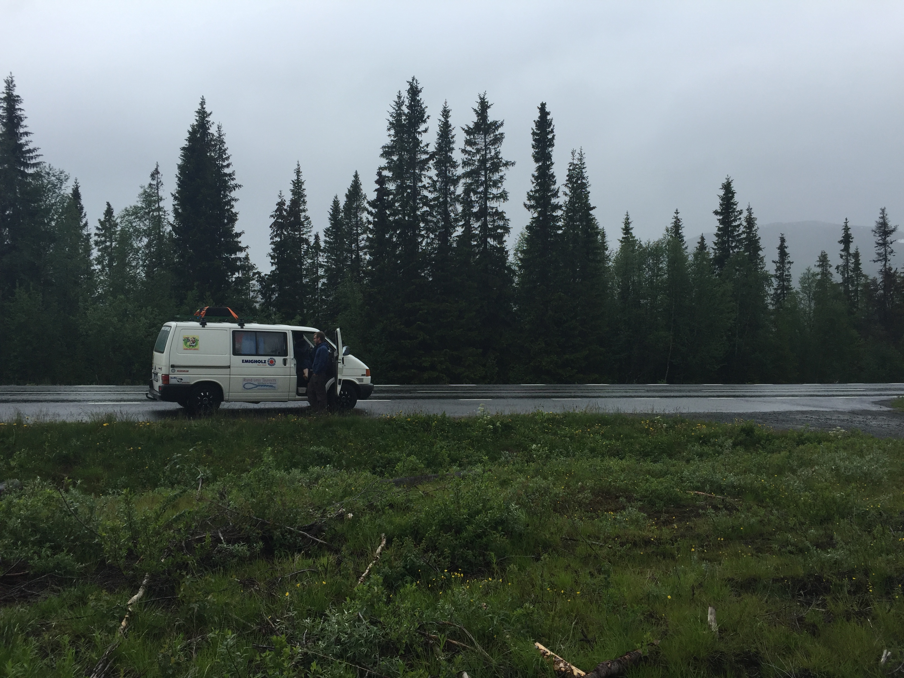

Der Weg war lange aber wir haben es nun fast hinter uns; von Hamburg zu den
Lofoten.

Vor zwei Tagen waren wir noch in Südschweden, jetzt sind wir auf der Fähre und
nurnoch 3 Stunden von den Lofoten entfernt. Auf dem Weg hier her hatten wir
einiges gesehen. Es hat sich herausgestellt, dass wir miserable Angler sind und
wir haben den Nordpolarkreis überquert. Wir hatten nun schon seit einigen
Nächten keine Dunkelheit mehr und ohne eine Uhr wäre es unmöglich zeitig ins
Bett zu gehen, um genug Schlaf zu bekommen.

11-15 Stunden, inklusive Pausen, haben wir teilweise auf der Straße verbracht,
um rechtzeitig zur Midnight Sun Party am Treffpunkt auf den Lofoten zu sein.
Wir haben nun ca. 2,500 km seit Hamburg zurückgelegt und damit in den ersten 4
Tagen ca. 1/3 der Strecke.

Die Veränderung der Landschaft ist beeindruckend und ich freue mich noch auf
die vielen schönen Eindrücke, die vor uns liegen.

Bis zum nächsten mal,

Jan
