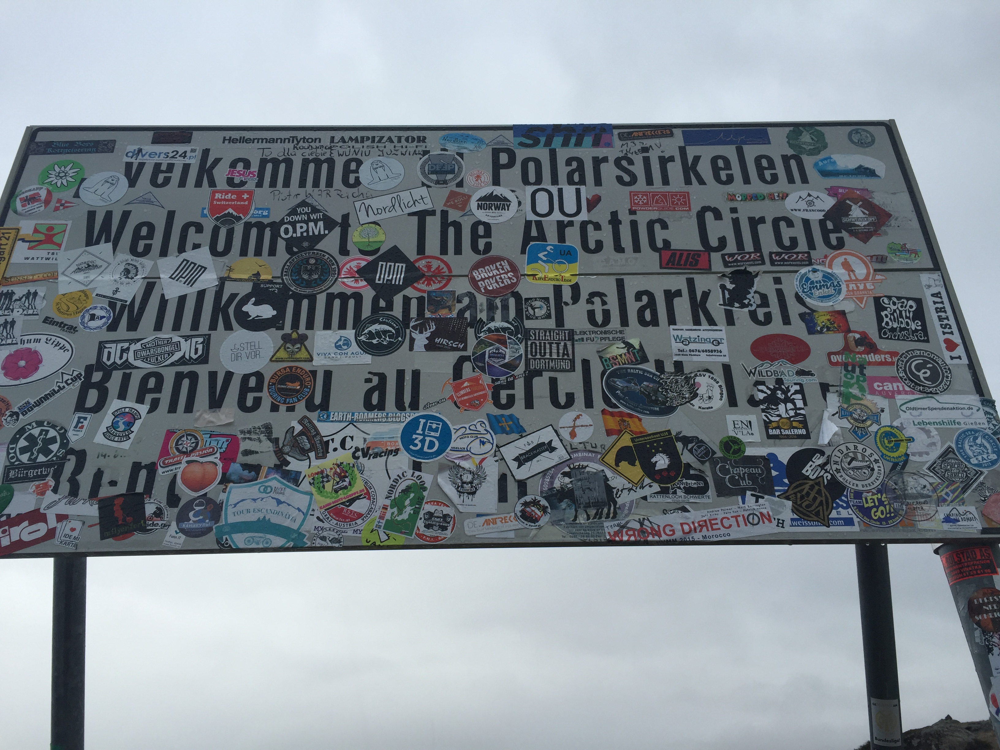
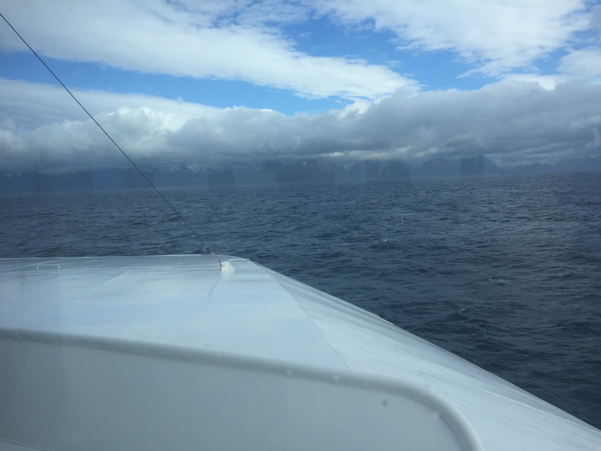
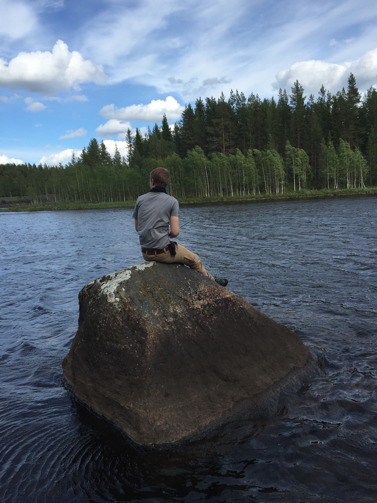
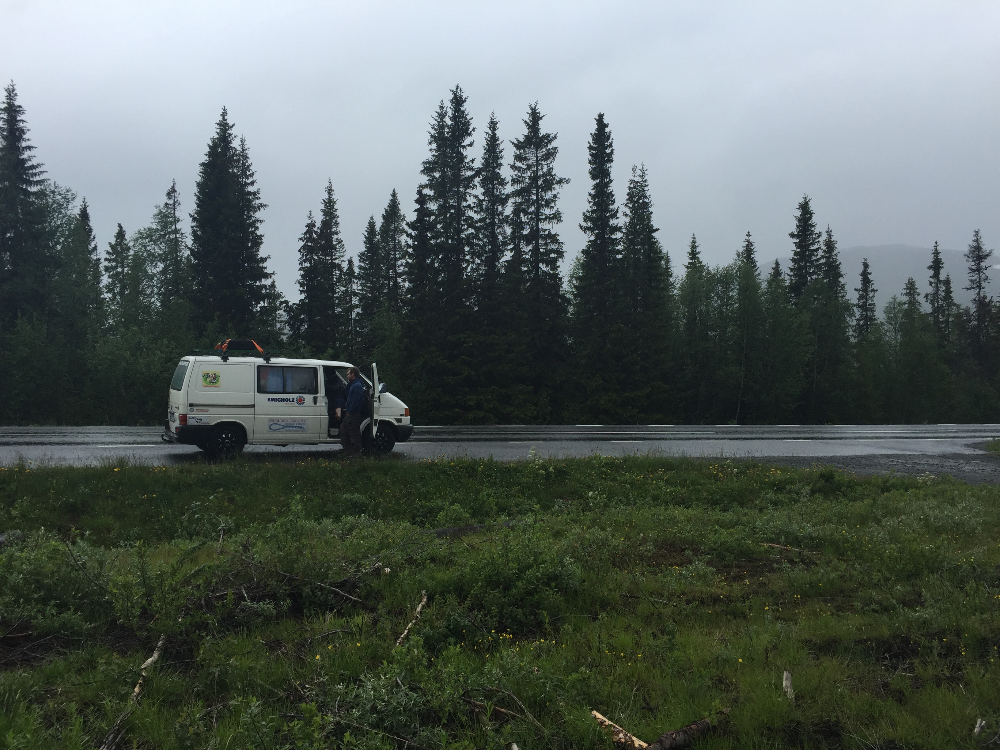

The journey was long but we are finally in arms reach; from Hamburg to the
Lofoten.

Two days ago we were still in southern Sweden and now we are on the ferry three
hours from the Lofoten. We saw and experienced alot. It turned out we are
miserable fishermen and we crossed the Arctic Circle. We are now a few nights
in without darkness which makes it impossible to know when you have to go to
bed to get a good night’s sleep. God bless the clock.

11-15 Hours, including breaks, is what we roughly spent on the road each day to
make it to the Midnight Sun Party on the Lofoten. We drove 2,500 km since we
left Hamburg that covers 1/3 of the distance in the first 4 days.

It’s remarkable how the landscape changed and I’m looking forward to the things
ahead.

See you next time,

Jan
