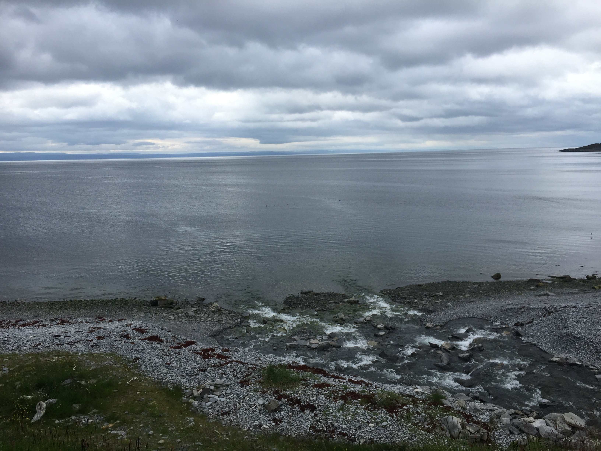
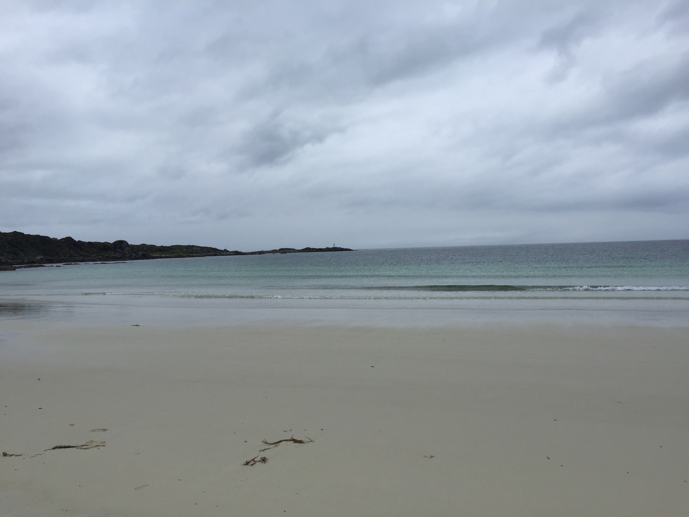
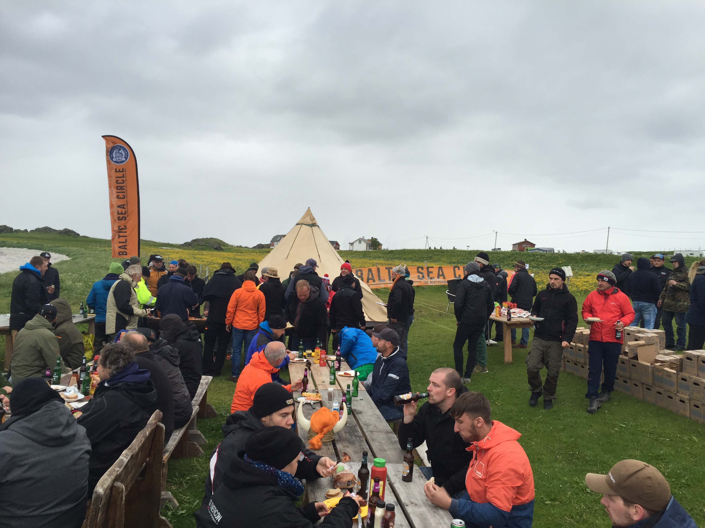
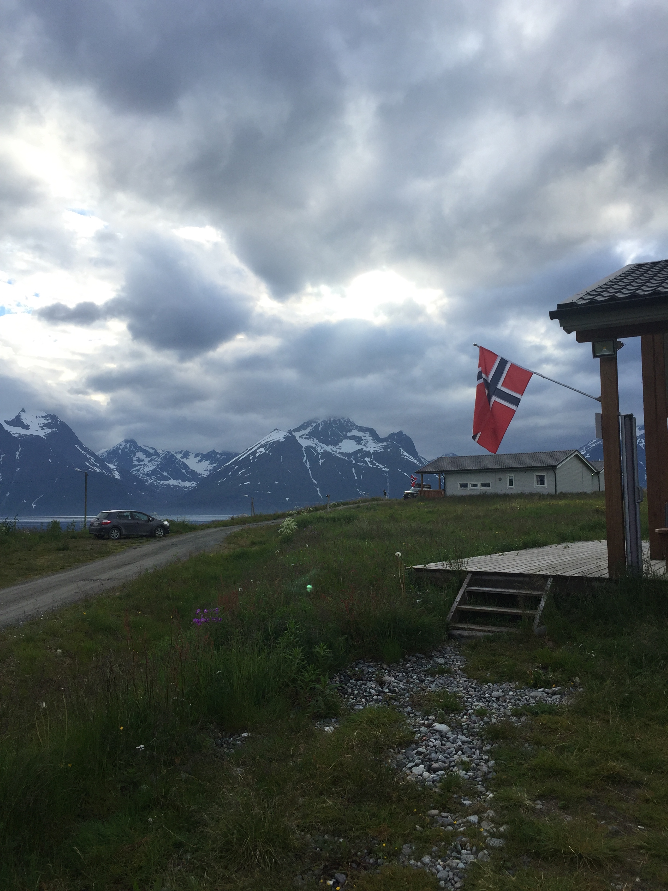
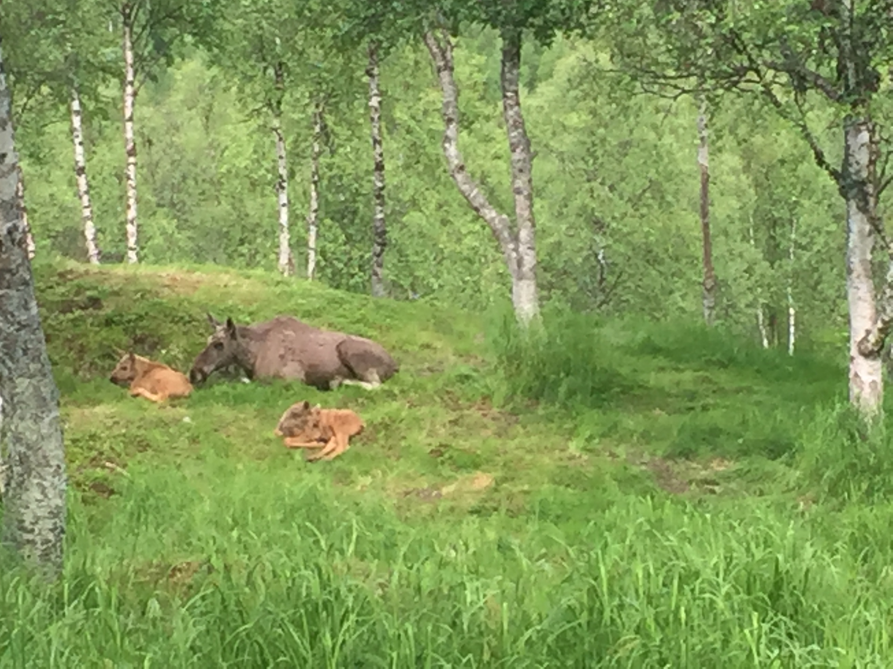
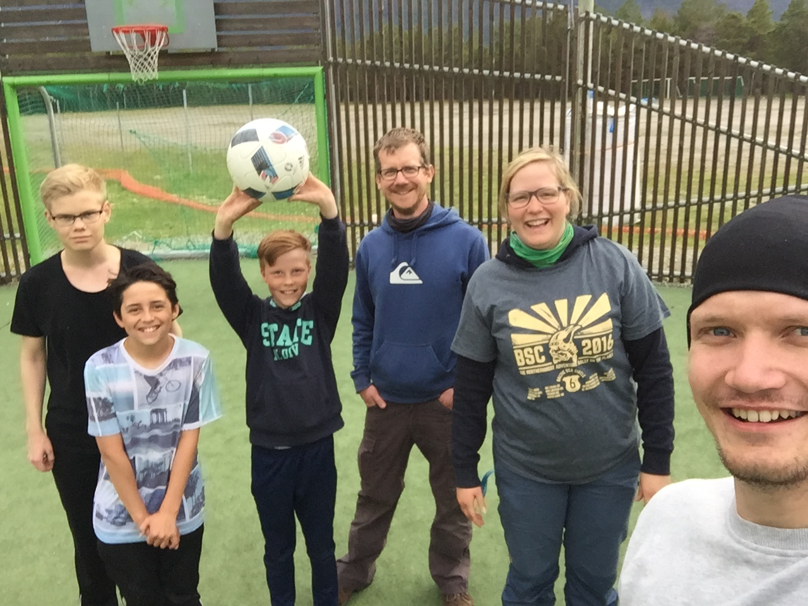
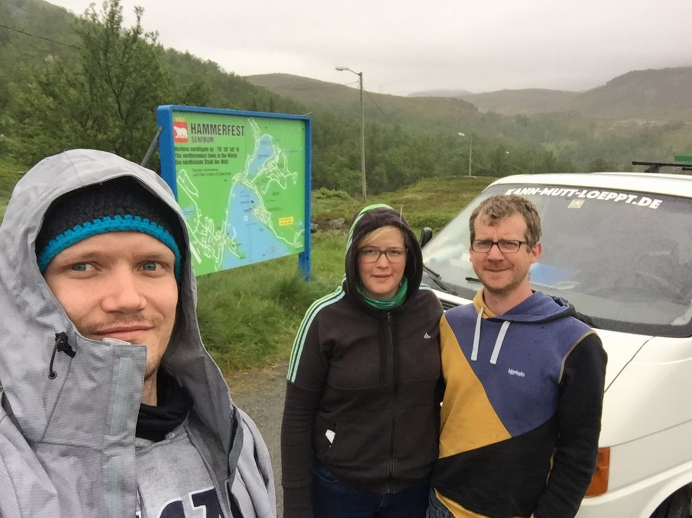
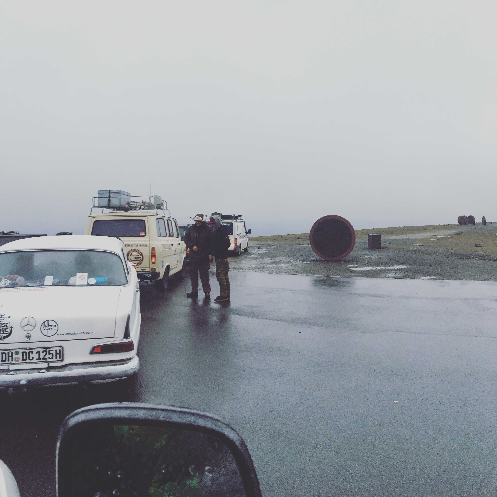
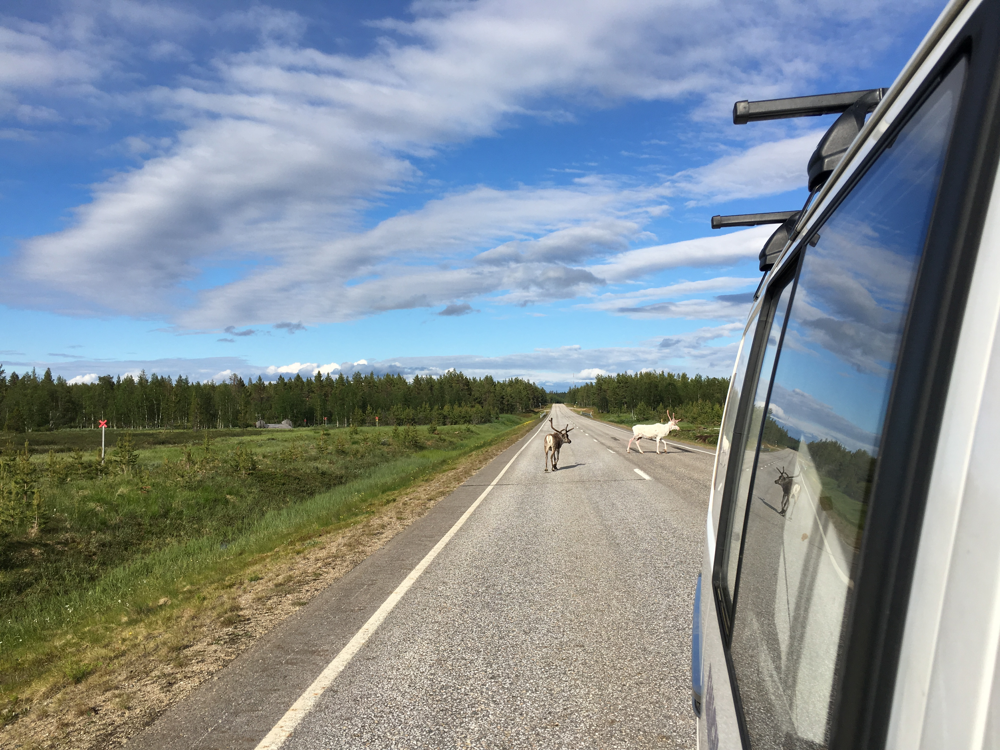

Wie viele von euch wahrscheinlich sich schon gedacht haben waren die Lofoten
wie aus dem Bilderbuch. Die schroffen Felsen, die raue See, die kleinen Häuser
verstreut in den Wiesen der bergigen Inseln.

Leider war das Wetter eher bescheiden. Es war regnerisch, windig und
größtenteils bewölkt. Die Übernachtung war auf einem Campingplatz direkt am
Strand und wir haben uns mit allen Teilnehmern getroffen, um die Midnight Sun
Party zu feiern. Es gab Gegrilltes und Viking Games bei denen wir gleich in der
ersten Runde ausgeschieden sind.

Am Morgen brachen wir auf Richtung Norden, mit einem Stop auf der Strecke, um
zu schlafen,

einem, um einen Wildpark zu besuchen,

und einem, um die nächste Aufgabe zu erfüllen ging es zum Nordkapp. Die Aufgabe
die wir erfüllen mussten war mit einem Fußball Club Fußball zu spielen. Wir
haben 3 Jungs gefunden, die sich bereit erklärt haben mit uns Fußball zu
spielen. Wir haben 3:0 verloren.

Da wir nur nachts zwischen  1 und 8 Uhr morgens am Nordkapp unser Bild schießen
könnten, haben wir noch einen weiteren Stopp in Hammerfest eingelegt. Haben was
gegessen und uns in der Royal and Ancient Polar Bear Society ein bisschen die
Zeit vertrieben.

Am Nordkapp haben wir nochmal 2h geschlafen und uns dann für das Bild bereit
gemacht. Das eigentliche Bild folgt, da es noch auf Ines Kamera ist. Hier ein
Bild aus der Schlange:

Jetzt sind wir seit ein paar Stunden in Finnland und auf dem Weg wieder in
wärmere Gefilde. Auf Schritt und Tritt verfolgen uns die Rentier. Ziel für
heute ist Rovaniemi.

Bis zum nächsten mal,

Jan
