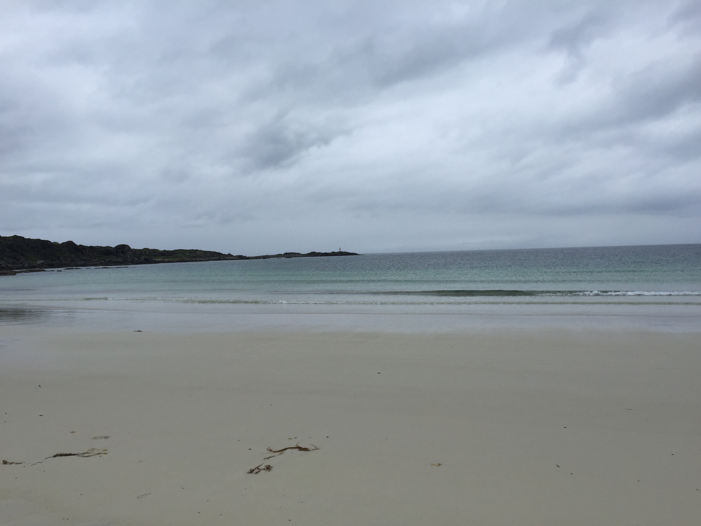
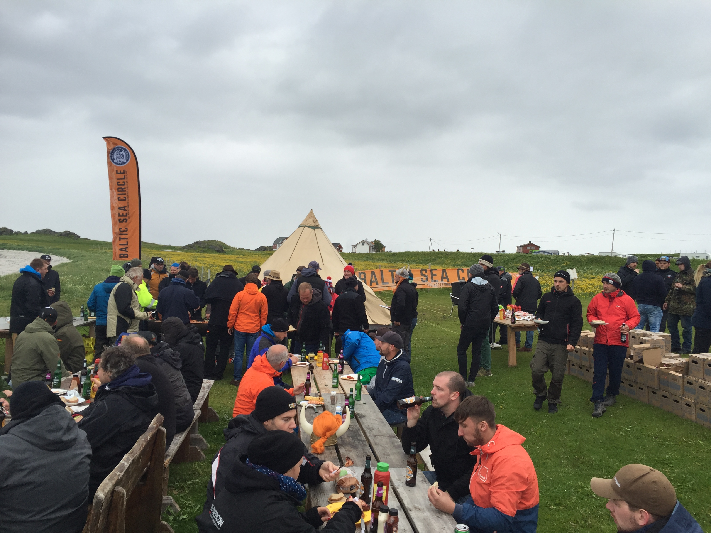
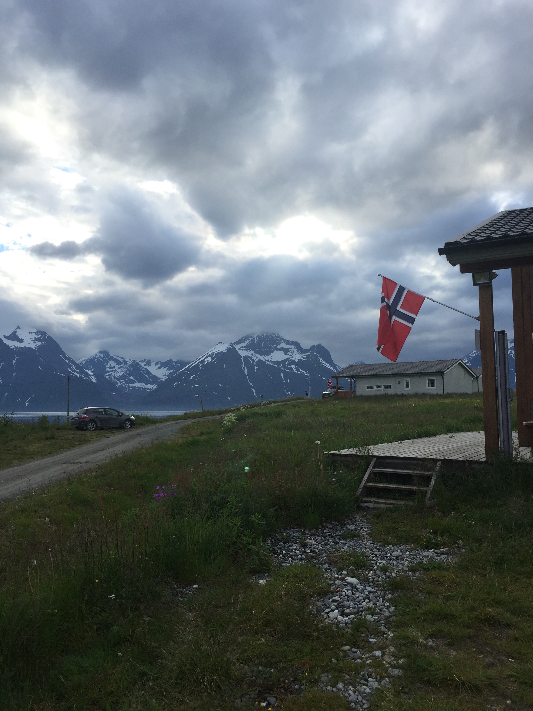
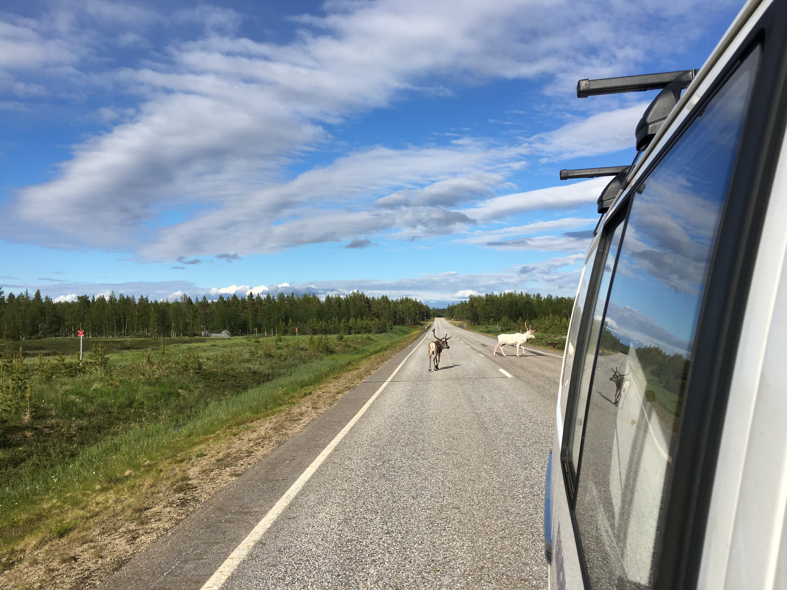

You guessed it probably already, the Lofoten were picturesque. The rocks, sea
and little houses that a spread on the lush meadows In the midst of the
mountains add to the atmosphere.

Unfortunately, the weather was only mediocre. It was quite rainy, windy and
cloudy. We camped on a ground directly at the beach and met with all the other
teams to celebrate the midnight sun party. We had a BBQ and participated in the
viking games. However, we were eliminated in the first round already.

In the morning we left towards the North with a stop along the way to catch up
with some sleep,

another to visit a wildlife park,

And yet another one to fulfill the next challenge. The challenge was to play
football(soccer) with a local club. We met three kids who were more than happy
to kick a bit. We lost three nil.

since we were only able to get our picture at the Nordkapp between 1 and 8 am
we made another stop in Hammerfest. We got dinner and spent time in the Royal
and Ancient Polar Bear Society.

Upon arrival at the Nordkapp we got 2 hours of sleep before getting ready for
the picture in front of the globe. You’ll get the official one once we copied
it from Ines camera. Until then you have to put up with a picture from the
queue:

We just entered Finland a few hours ago and are well on our way towards warmer
areas. Reindeers are always on our heels. Our goal is to reach Rovaniemi.

See you next time,

Jan
