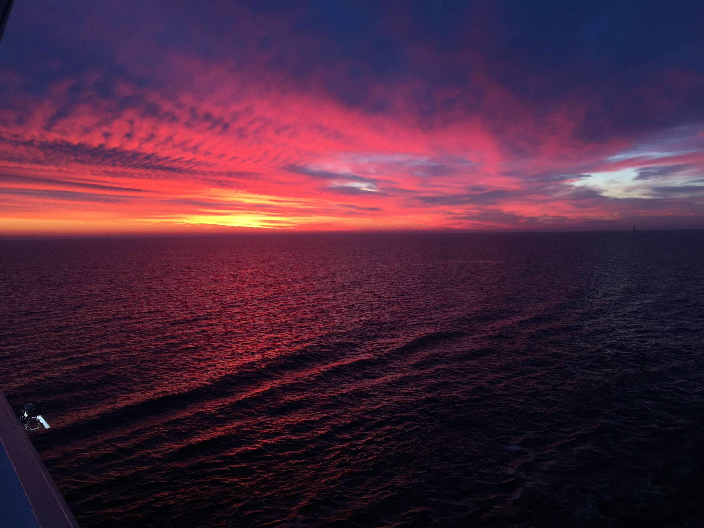
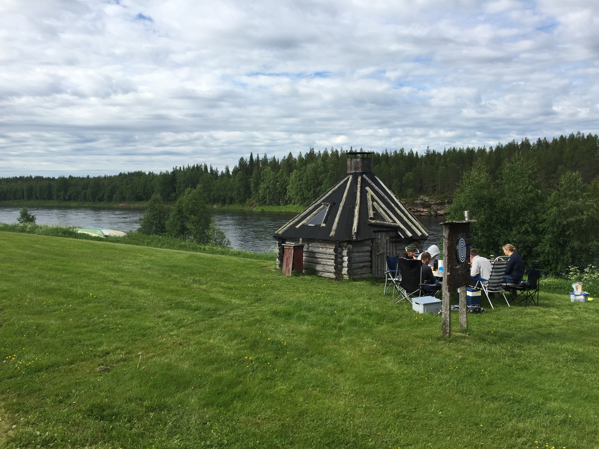
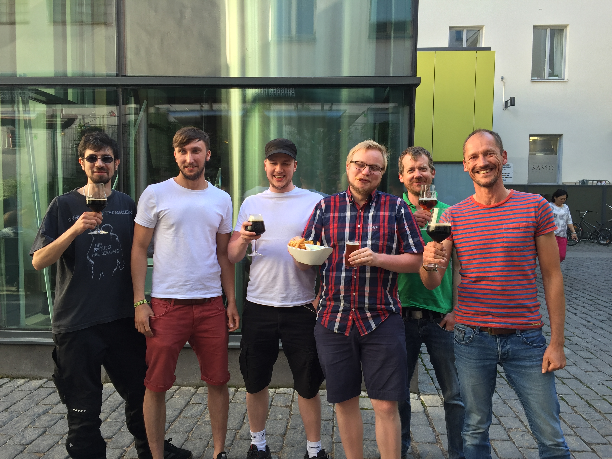
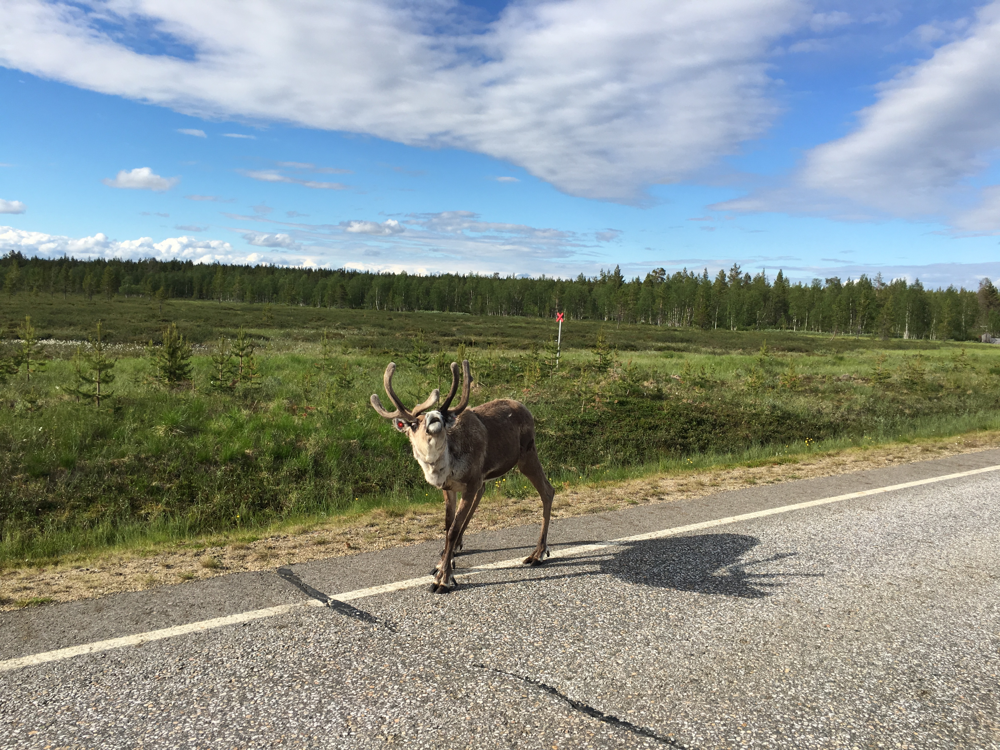
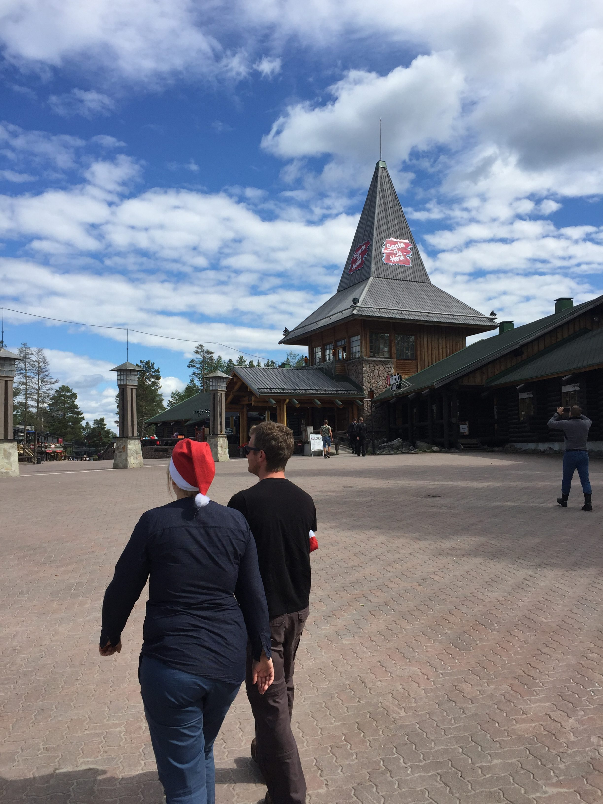
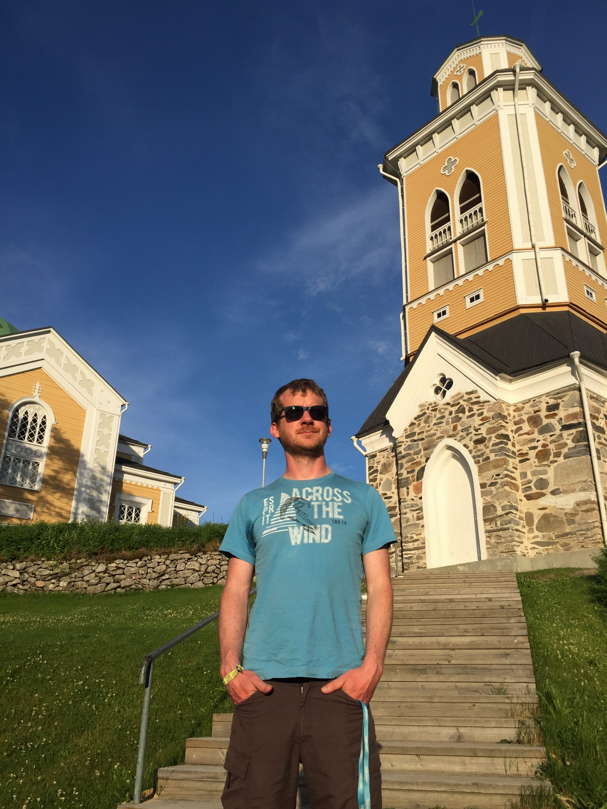
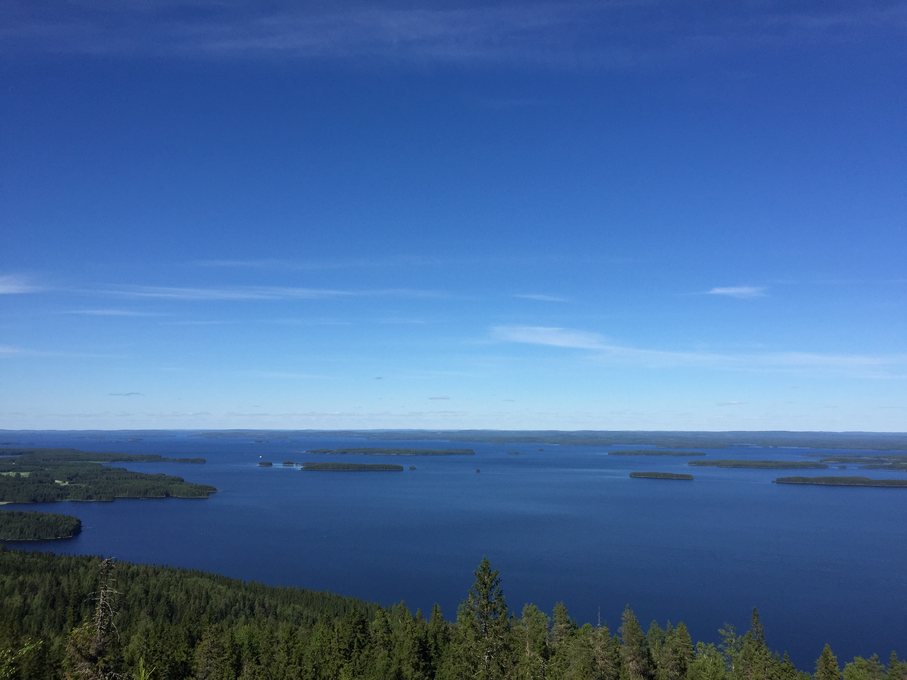
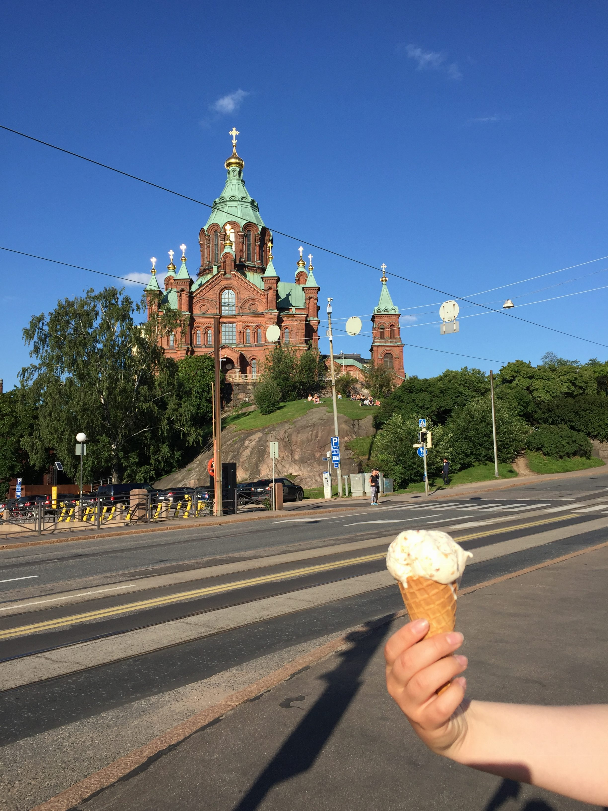

Jeder kennt Skandinavien oder hat davon gehört. Keine hat so wirklich eine
Ahnung, welches Land dazu gehört. Manch einer nimmt Finnland gerne mit in die
Liste auf. Laut Wikipedia ist das aber nicht ganz eindeutig und wer einmal in
dem Gebiet war wird das leicht verstehen. Suomi, wie Finnland in der eigenen
Sprache und auch im Großteil des Baltikums genannt wird, passt nämlich nicht
ganz in das Bild Skandinaviens rein. Die Sprache, Mentalität und das Land haben
kaum etwas mit Schweden oder Norwegen gemein.

Zwei nette Finnen, die wir in Helsinki beim Essen getroffen haben (nächstes
Bild, die beiden Mittleren), klangen auch eher als wenn sie sich näher den
Estländern fühlen als den Skandinaviern. Wenn man darüber nachdenkt leuchtet es
auch ein. Sprache und Kultur sind den Estländern und dem Baltikum viel
ähnlicher.

Das Land selber ist grün, und übersät mit kleinen und großen Seen. Im Norden
ziehen größere und kleinere Rentier Herden durchs Land und blockieren gerne mal
die Straßen. Während der Norden über dem Polarkreis liegt und wir seit ein paar
Tagen keine Nacht mehr hatten waren wir froh im Süden angekommen zu sein.

Ein Besuch im Weihnachtsmann Dorf,

der größten Holzkirche der Welt

und Nationalpark

standen auf dem Plan bevor wir in Helsinki die Fähre über die Bucht nach
Estland nahmen.

Drei Tage waren auf jeden Fall zu kurz. Aber wir haben ja ein Ziel und das ist
am Sonntag auf dem  Fischmarkt in Hamburg zu sein. Bis dahin steht der Rest des
Baltikums und Polen an.

Also bis zum nächsten mal,

Jan
