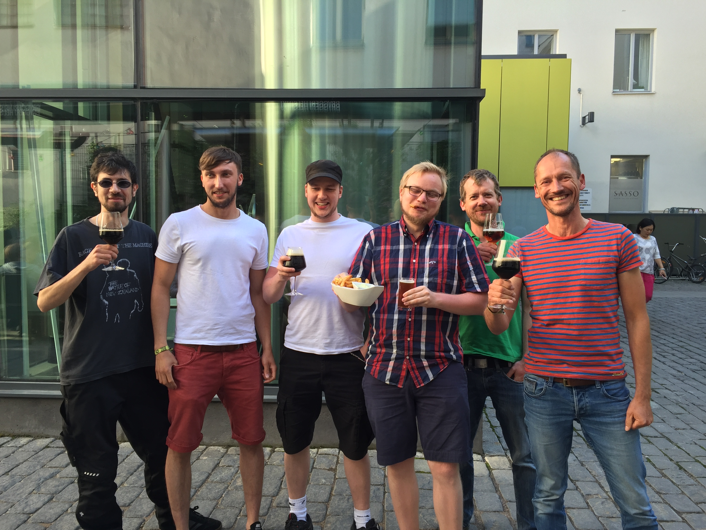
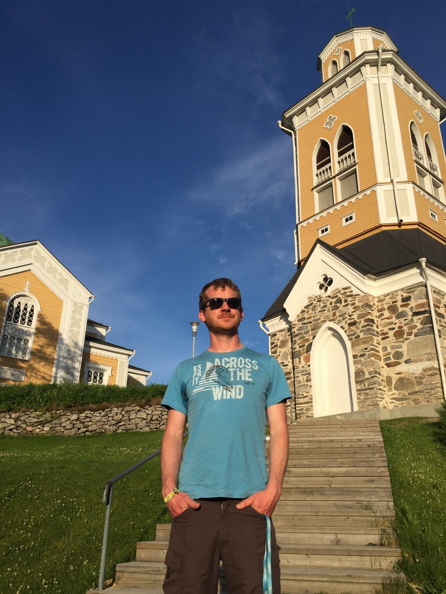

You all know Scandinavia or at least heard of it. However, what countries do
actually belong to it? Some might consider Finland to be part of it. According
to Wikipedia it’s not really clear and anyone who visited the country can
understand why. Suomi, how it’s called in the local language and in the
majority of the Baltic, does not really fit into the Scandinavian picture
that’s painted by Sweden and Norway. The language, mentality and the country
can be quite different.

Two nice Finish men who we met in Helsinki (see next picture; the two guys in
the middle), sounded more drawn towards Estonia than Scandinavia. If you think
about it it will make sense. Language and culture have probably more in common
with a Estonia and the other Baltic states.

The country itself is lush and sprinkled with lakes both large and small.
Reindeer gangs are roaming the forests and streets in the North living a life
of crime. The northern part is north of the Arctic Circle and we didn’t
experience darkness for a couple of days so we were happy to have a proper
night when we came south.

A visit in Santa Claus Village,

The largest wooden church in the world,

and a national park close to Koli,

Were on our itinerary before we arrived in Helsinki and took the ferry to
Estonia.

Three days were definitely too little time. But we have a goal and that is to
reach Hamburg by Sunday. Until then we gonna go through the Baltic states and
Poland.

See you next time,

Jan
