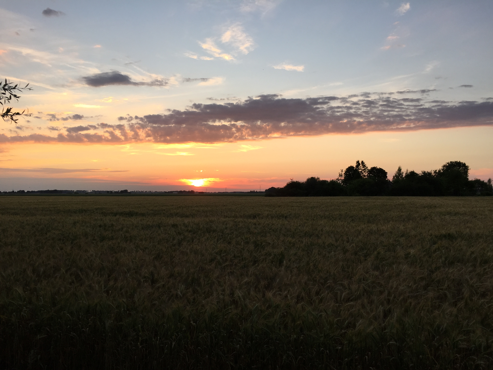
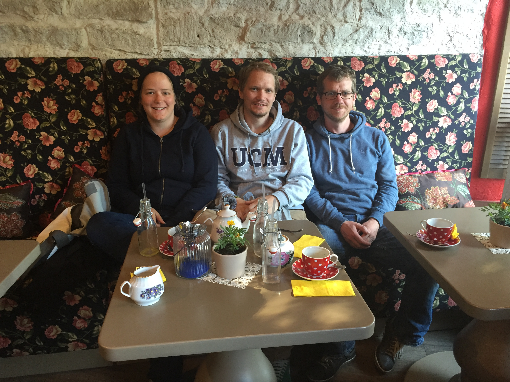
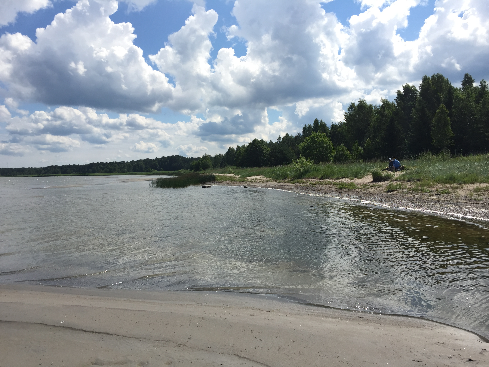
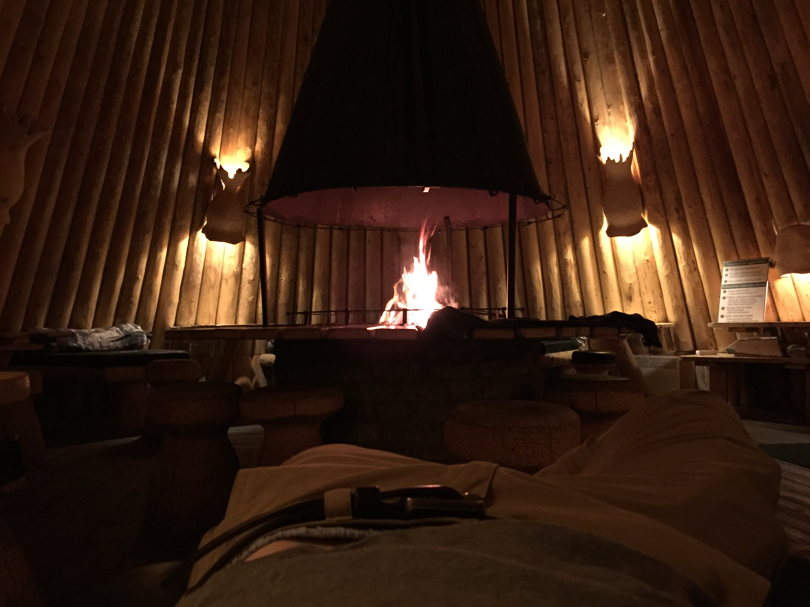
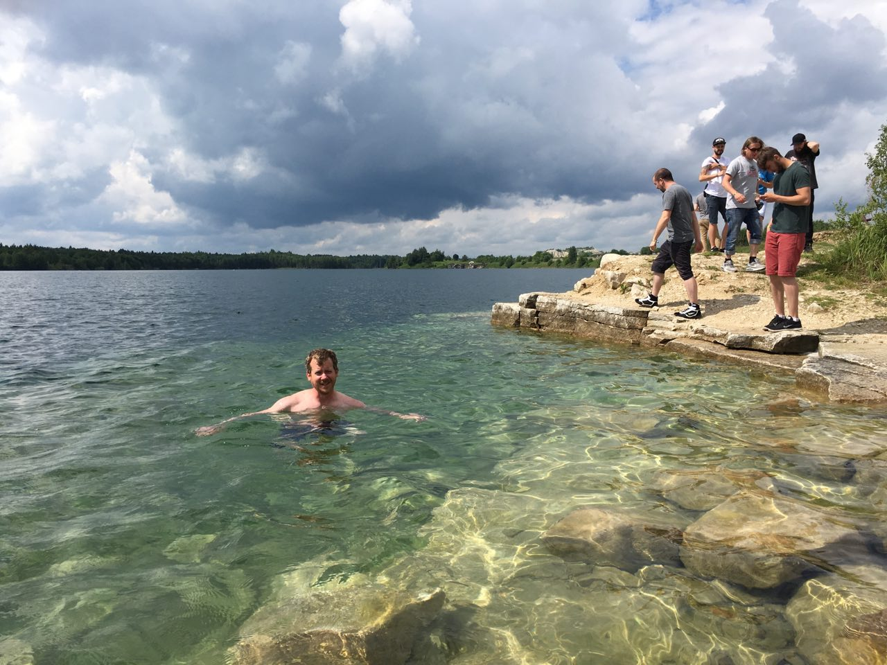
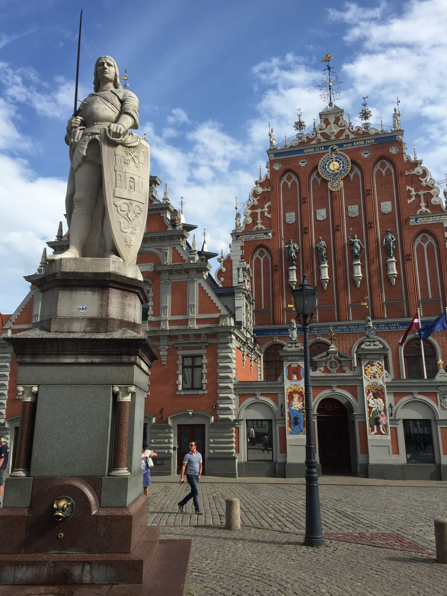
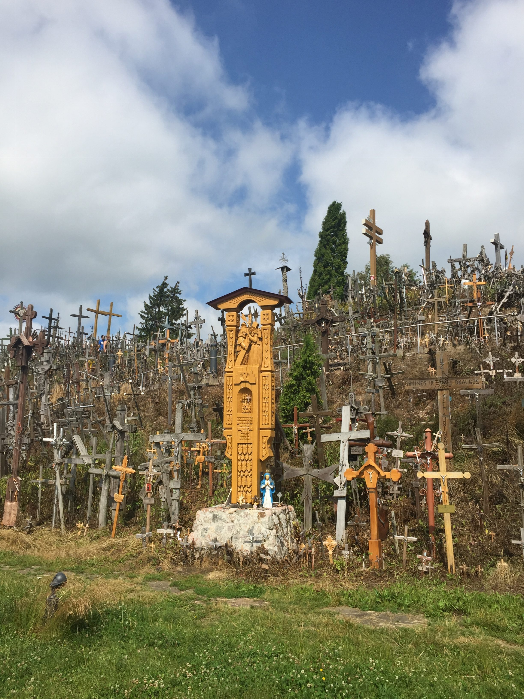
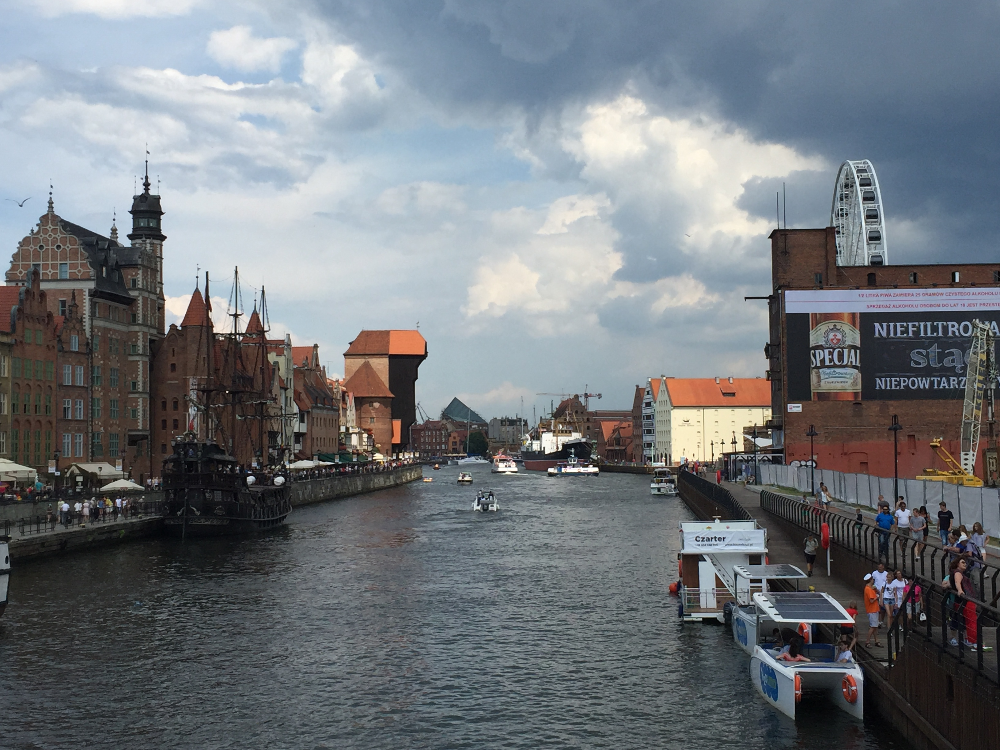
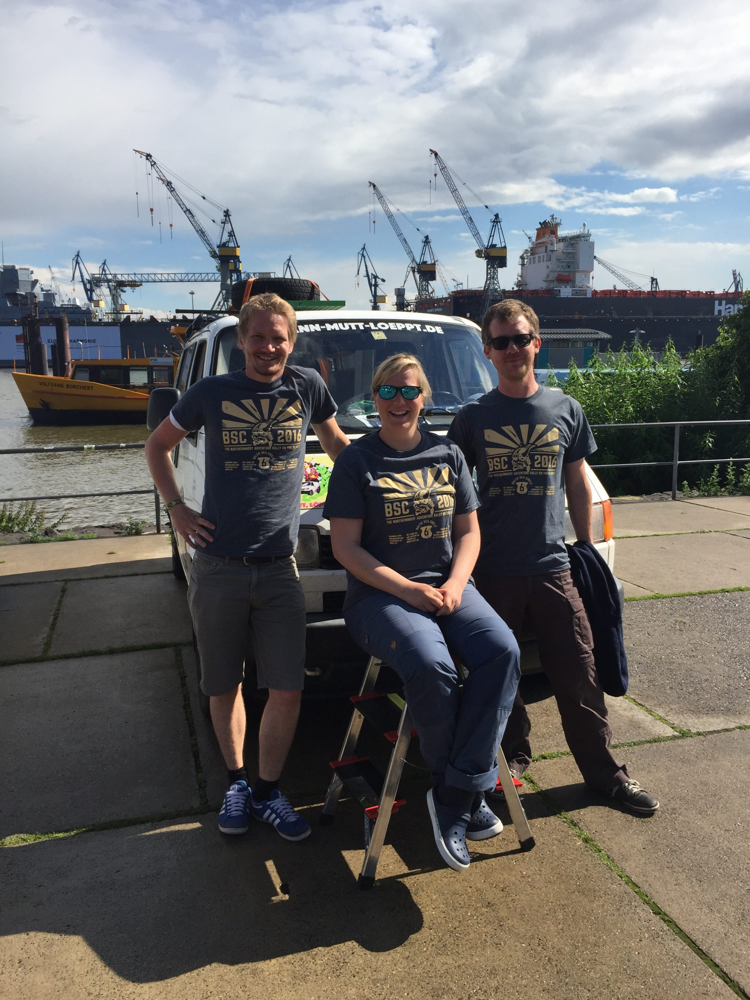

Von Helsinki ging es nun über die Bucht in die Hauptstadt von Estland, Tallinn.
Eine wunderschöne Altstadt hat uns schon erwartet, allerdings waren wir viel zu
früh. Als wir gegen ca. 7 Uhr morgens durch die Straßen der alten Hansestadt
schlenderten hat die Stadt noch geschlafen. Die Stadt versprach aber viel, und
ich persönlich möchte noch einmal vorbeikommen, um die Stadt belebter zu sehen.

Wir machten uns also auf den Weg zur zweiten Party location, wo wir die
restlichen 199 Teams für eine weitere Nacht, ähnlich den Lofoten treffen
sollten. Es ging ab in ein Naturschutzgebiet, mit Saunalandschaft, Trampolin
und Biotoiletten. Als wir ankamen waren wir eins von 3 Teams und es war
perfekt, um mal zu entspannen. Wir hatten noch ein paar Stunden bis es
offiziell los ging.

Schnell wurde es voller und es ging los. Wir feierten die bisherigen knapp
6,000 Kilometer, verbrachten Zeit in den Saunen und vielen schließlich
erschöpft ins Bett.

Als nächstes ging es nach Riga, der Hauptstadt Lettlands. Auf dem Weg dahin
noch schnell einen Abstecher zu einem 

Nun, Riga, eine weitere Hansestadt zeigte sich von seiner besten Seite im
strahlenden Sonnenschein und wir erkundeten für ca. 2 Stunden die Altstadt,
anschließend trafen wir uns mit 4 anderen Teams für die Nacht auf einem
Campingplatz.

Litauen haben wir nur aus dem Fenster gesehen, und machten einen kurzen Stopp
am Berg der Kreuze, Kryziu Kalnas. Der Berg hat scheinbar mehrere Zwecke
erfüllt und es ist auch, soweit ich es verstanden habe, nicht klar wie und wann
genau er entstanden ist. Scheinbar ein Ort der Trauer für verlorene Verwandte.
Fakt ist, dass es ziemlich viele Kreuze und Touristen an dem Ort gibt.

Anschließend verbrachten wir noch 2 Nächte in Polen, jeweils einmal in Ostpolen
und kurz vor der deutschen Grenze. Am Tag dazwischen besuchten wir wieder ein
paar Stunden eine wunderschöne Hansestadt, Danzig.

Nun sind wir heile in Deutschland angekommen. Wir haben 9 Länder besucht,
8017km mit dem Auto gereist, 16 Tage 3 Stunden und 52 Minuten von Start bis
Ziel gebraucht, viele neue Freunde und Bekannte gesammelt, 1712,70€ an Spenden
für die Arche, Fahrräder für Flüchtlinge und die VWV Jugendgruppe gesammelt.

Viel Spaß euch und bis zur nächsten Reise,
Jan
