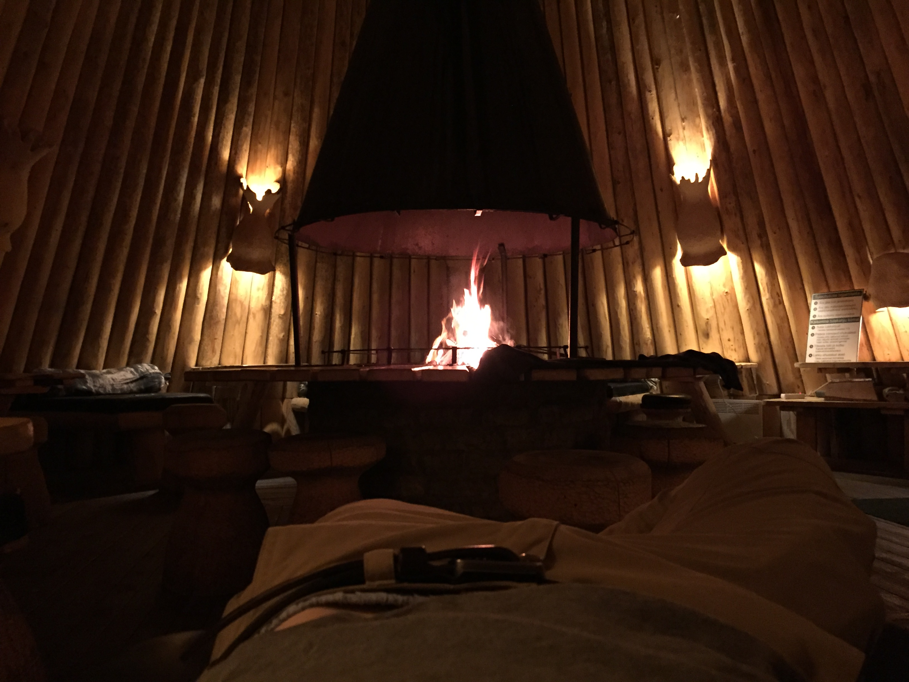
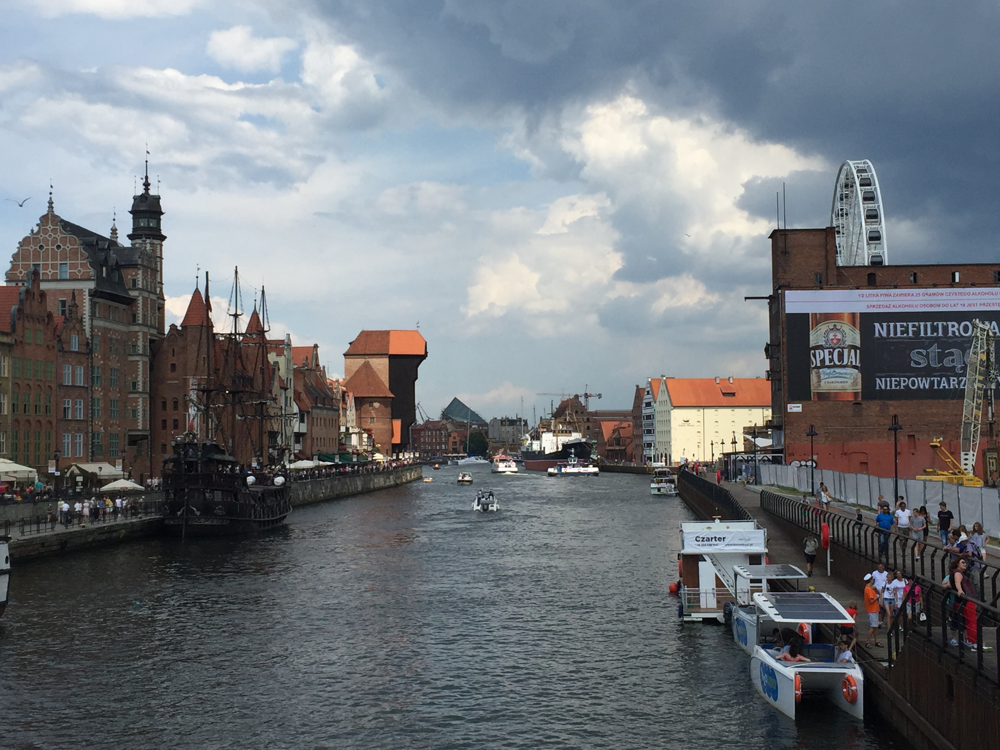

In Helsinki we took the ferry to cross the bay and get to the capital of
Estonia, Tallinn. A astonishing old city center was already waiting for us,
however we were much to early in the morning. As we got of the ferry around 7
am and started roaming the streets of this old Hanseatic City everyone was
still fast asleep it seemed. The city however looked promising and I personally
still want to go back to see the city’s life.

We headed of to the second party location where we met the other 199 teams for
another night. The location was set directly in a national reserve with saunas,
trampoline and all natural toilets. When we arrived we were one out of 4 teams
at the location, we used the time to winde down and refuel before the the
official start of the official event.

The camp ground quickly filled up. We celebrated the roughly 6,000 km that we
drove so far, spent time in the saunas until we finally dropped into our
sleeping bags.

The next day we headed towards Riga, the capital of Latvia. On our way we made
a stop at a 

Well, Riga, another Hanseatic city presented itself from it’s best side. We
explored the old city center in bright sunshine for 2 hours until we headed off
again and met with 4 other teams on a camp ground further south.

We only saw the last Baltic country from within our car except a short stop at
the Hill of Crosses, Kryziu Kalnas. The hill used to have several meaning and
as far as I understood it’s not really clear when the tradition started. De
facto, it’s a hill with loads of crucifixes which you can buy directly in the
tourist shop. It used to be a location to honour lost relatives or friends that
were send to Gulags or never returned because of different reasons.

We spent 2 more nights in Poland, once in the Eastern part and a second time
shortly before the German border. The day we had in Poland we stopped in
Danzig, yet another remarkable Hanseatic city.
Finally, we arrived safe and sound in Germany. We visited 9 countries, traveled
8017km by car, it took us 16 days 3 hours and 52 minutes from start to finish,
we met new friends, collected 1712,70€ for Die Arche, Fahrräder für Flüchtlinge
and the VWV youth program.

Enjoy your day and see you on the next adventure,

Jan
