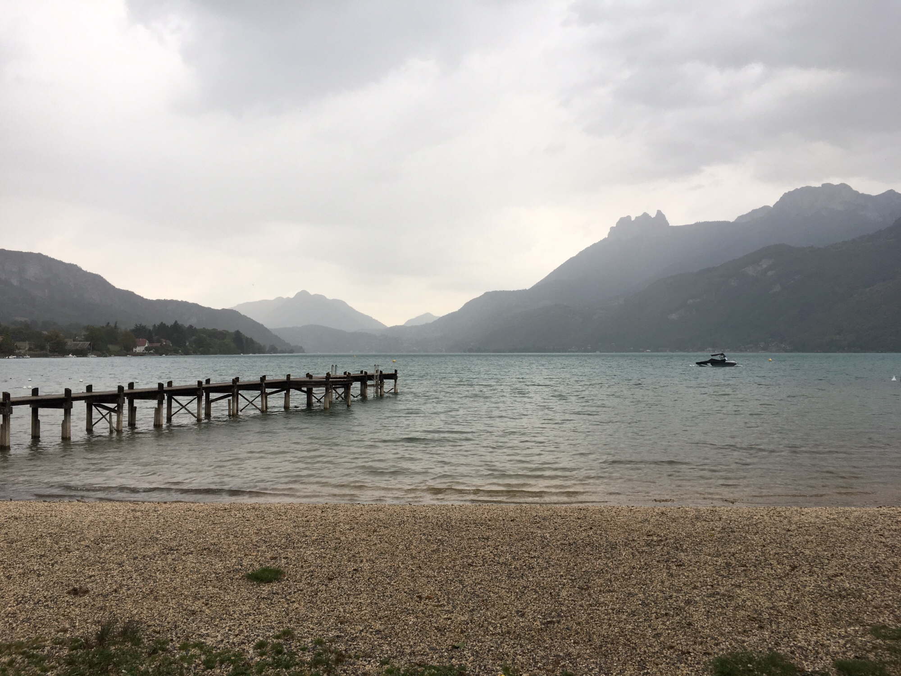
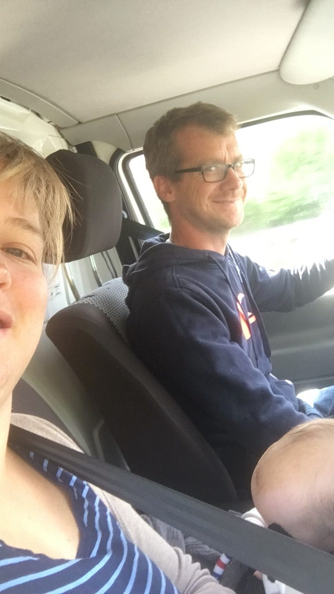
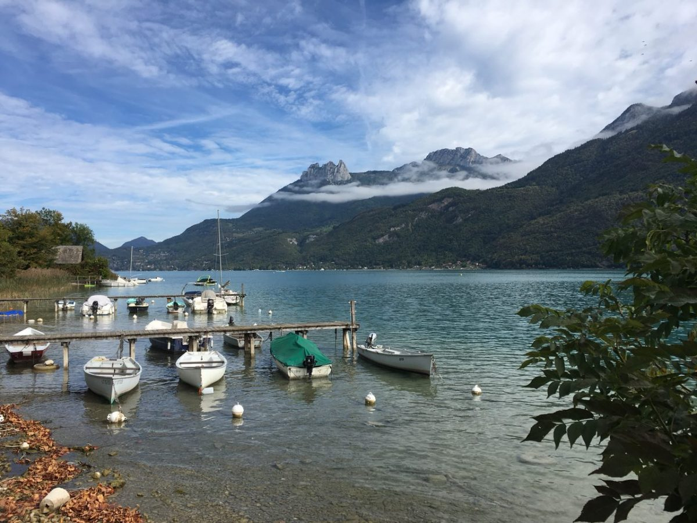
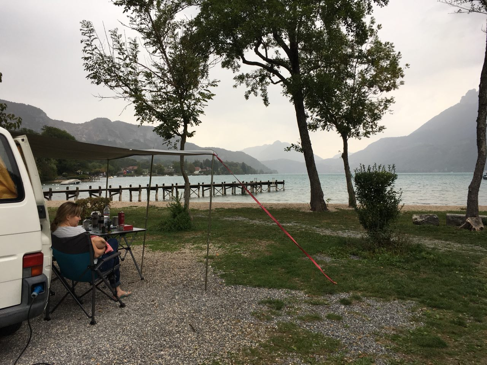
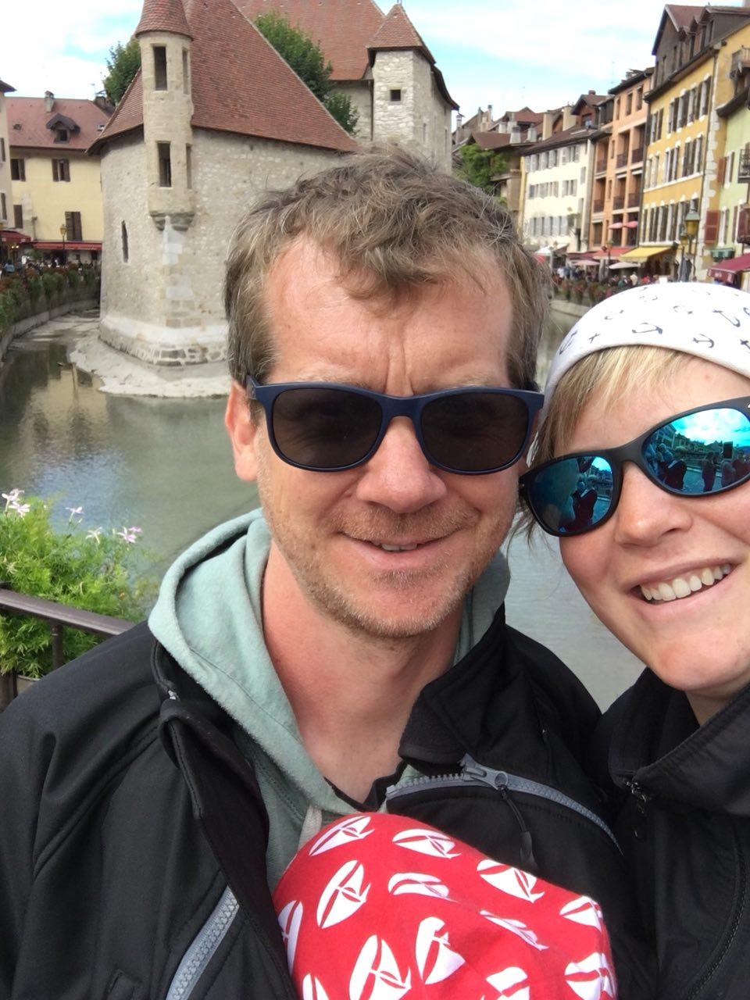
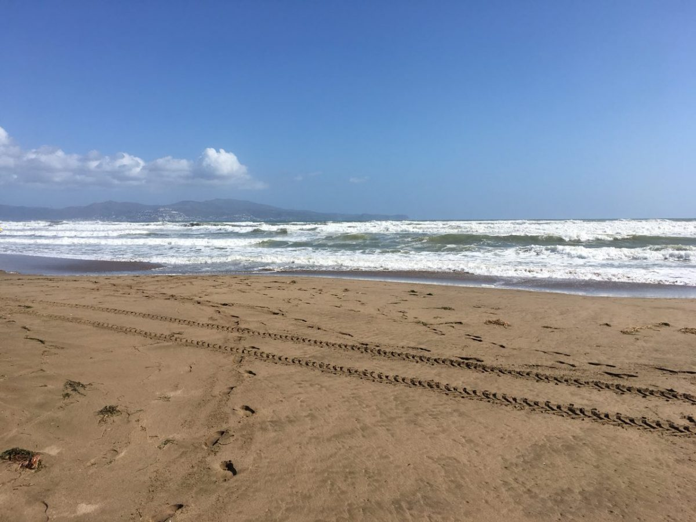
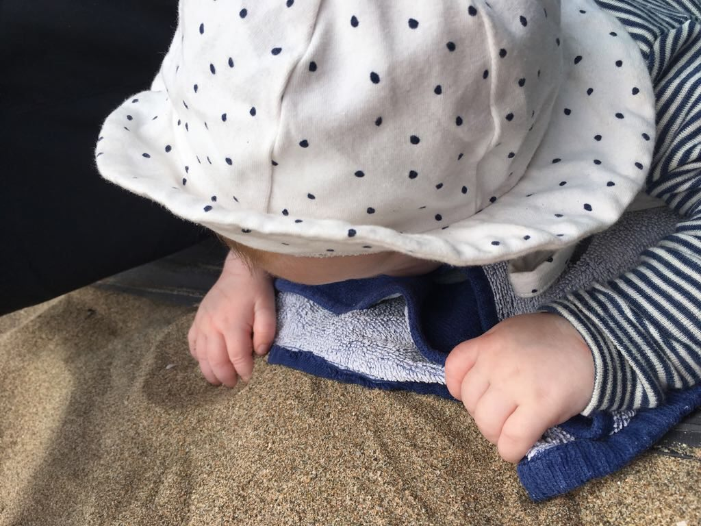
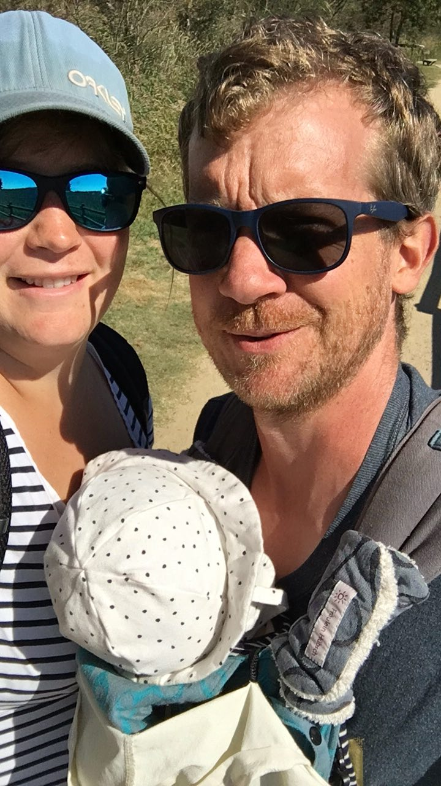

# Hochzeit in Wilhelmshaven

Jessi und Björn haben sich das Ja- Wort gegeben und wir durften dabei sein. Aus
einem guten Kollegen von Christian sind tolle Freund geworden.

Nach unserer Rundreise um die Ostsee sind wir spontan zum Bulli- Treffen
gefahren. Christian meinte: “Da kommt einer von der Arbeit mit und seine Frau.
Lass mal auch fahren.” Aus dieser spontanen Idee wurde eine tolle Freundschaft
zu der auch mittlerweile Lisa und Simon gehören. Alle haben wir einen VW Bus
und lieben das campen. Alle haben wir ein Kind, Lotti ist die Älteste, Ole der
Mittlere und Hahn im Korb und unsere Gesa. Und zu der Hochzeit waren wir in die
Fulltime- Gesa- Betreuung gestartet. Eine schöne Hochzeit, romantisch am Strand
und lecker und schick an den Skiterassen in Hooksiel. Christian hatte seinen
beiden Damen zum Diskofox aufgefordert und es hat geklappt.

#Kölle: Familienbesuch und Einstimmen auf den Urlaub
Am Sonntag noch bei Knutsche- Oma und -Opa zum Mittag verabschieden, der
“kleinen” Cousine bei Mathe helfen und den letzten Rest packen. Es hat alles
geklappt und wir sind um 22.30 Uhr gestartet. Nach einer Stillpause sind wir
dann auch um 02.00 Uhr am Montagfrüh bei Christians Bruder in Kölle angekommen.
Unseren kleinen Neffen nach langer Zeit wieder beherzen und aufwachsen sehen.
Justus ist nun fast ein Jahr alt. Der Montag und Dienstag standen im Zeichen
von Christians Familie. Gesas Oma und ihr Lebensgefährte, Rüdiger, waren noch
vor Ort und Besuch von Opa Ernst und den (Groß-)Tanten standen auf der Agenda.
Rüdiger hat uns noch ein paar Reisetipps gegeben. In Kölle haben wir letzten
Sachen eingekauft, umgepackt und festgestellt was alles fehlt. Am
Donnerstagmittag juckte es Bob (unser VW Bus von den Segelnkinder liebevoll
benannt) und uns zur Weiterfahrt. Über einen kleinen Zwischenstopp zur
Mittagshitze kurz vor Strasbourg sind wir im Schwarzwald gelandet. Der
Campingplatz Lug ins Land ist zu empfehlen. Es gibt ein leckeres Bistro und
tolles Schwimmbecken mit Solarenergie geheizt. Am Straßenrand haben wir
wunderbare Weintrauben, Äpfel, Tomaten und Feigen bekommen. Klasse, frischer
geht es wirklich nicht!

# Lac d’ Annecy

Rüdigers erstes Tipp! Ein Traum! Vom Schwarzwald ging es weiter über die
Schweiz nach Frankreich an den Lac d’ Annecy. Hier passte das Lied “Ich liebe
das Ende der Saison”. Wir wollten 2 Tage bleiben und der Platz hatte nur noch 2
Tage auf. Auch die Seefähre hatte nur noch 2 Tage Dienst. Timing!!! Der Platz
war fast leer, wir hatten somit einen tollen Platz in der ersten Reihe.
Seeblick beim Aufstehen! Die erste Nacht war etwas stürmisch und so hat
Christian noch das Vordach abgebaut, das uns beim Essen vorm (Dröppel-)Regen
geschützt hat.

Am Morgen gibt es mit der Fähre nach Annecy rein, eine kleine, schöne, alte
Stadt mit kleinen Cafés, Restaurants und Eisdielen. Nach einem sehr leckeren
Eis haben wir noch die Sonne im Park mit bei einem Baguette genossen. Noch eben
was im Supermarkt einkaufen: ein Paradies für Meeresfrüchte und Käse! Somit gab
es wieder Grundlage für Christians sehr leckeren Kochküste in unserem -leider
zu kleinen- Kühlschrank.

# Hitze auf der Weiterfahrt: San Pere Pescedor vor Barcelona
Leider wurde die Weiterfahrt in die Nähe von Figueres durch die Mittagshitze so
getrübt, dass wir fast abgebrochen hätten. In unserem Bob gibt es keine
Klimaanlage und die Sonne schien direkt von vorne rein. Für Gesa haben wir eine
Klimaanlage über nasse Tücher gebaut, aber sie war dennoch nicht begeistert.
Zum Glück standen 4 Nächte auf dem gleichen Campingplatz auf unserer “Planung”,
somit sollte auch Gesa wieder entspannen können.

Wir haben direkt einen Platz neben Christians besten Freund und seiner Familie
bekommen. Diese nutzen auch einen Monat Elternzeit um zu fünft sich besser
kennen zulernen und aus dem Alltag zu “entfliehen”. Eine ganzschöne Umstellung
für Gesa und mich, die doch bisher den meisten Trubel im Alltag durch Radio,
Babyschwimmen, Pekip und unsere geliebten Bürgerpark- Spaziergänge hatten.

Es standen Stunden am Strand bei ein paar bewegten Windzügen für uns
Norddeutschen (okay, die Strandmuschel glich dem Strand von innen und Tage
später hatten wir alle noch Sand in den Ohren), beim Geocachen und wandern vor
uns. Lecker Essen, einkaufen beim Bio-Bauern, Muscheln sammeln… -und die
Muscheln waren nach 2 Tagen Wind wirklich sehr groß am Strand. (Papa hätte
wieder nach Bernstein als alter Ostseehase gesucht 😊.)- …und warten… auf die
Werkstatt…

Die erste Nacht standen wir noch auf dem Platz vor dem Wohnwagen unserer
Freunde. Beim Umparken am kommenden Morgen haben wir Christian noch belächelt…
“Naaa, kriegste den Rückwärtsgang nicht rein? Ist wohl Glückssache…” beim
Nachsehen kam die Ernüchterung. Ein Teil der Schaltung war dahin. Also mit
unserem Freund Marco in Bremen Kontakt aufnehmen: ärgerlich, aber kein
Beinbruch. Zur Not fixen mit einem Kabelbinder, aber keine Dauerlösung für die
nächsten Wochen. Dann doch lieber direkt in die Werkstatt (Tag 3). Und heute
morgen ging’s in die Werkstatt. Zum Glück war das Auto noch nicht zerlegt bevor
der Rückschlag kam: das falsche Teil wurde geliefert. Also noch eine Nacht
warten.

Dafür haben Gesa und ich einen wunderbaren Morgenspaziergang genossen, Muscheln
gesammelt, und wir sind alle ins östlich gelegene Naturreservat gefahren und
waren dort cachen und wandern.

Ich schreibe Euch wie es die Tage weitergeht. Bisher planen wir Bilbao und
hoffen auf ein paar kältere Tage in Portugal für unsere Weiterreise- Porto bis
Barcelona. Oder wird es doch Italien und Frankreich?

Liebe Grüße senden Euch, 

Gesa, Christian und Ines
