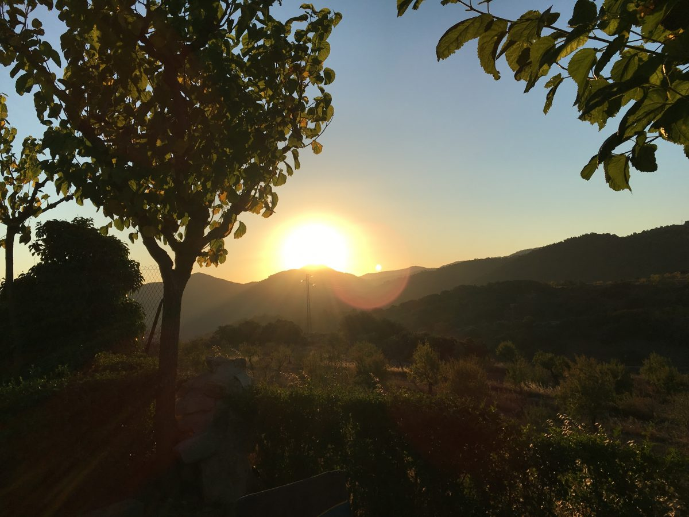

Der Werkstattbesuch am Freitag war erfolgreich! Bob rollt wieder und ist
deutlich leiser geworden. Überraschung – nichts was mehr dröhnt in der
Schaltung. Man kann sich bei 120km/h wieder normal unterhalten. Um dies
auszuprobieren sind wir Freitagmittag auch auf die Piste; eigentlich Richtung
Tarragona. Ein Blick bei googlemaps und die Erkenntnis das wir damit die Sonne
weiterhin von vorne während der Fahrt haben werden, lies uns aber vorher
Richtung Saragossa abdrehen.

Wir fanden einen schönen Platz in Vilanova de Prades. Ein mittelgroßer Platz am
Dorfrand mit vielen Tieren: Hühnern, Pferd und Pony sowie afrikanischen
Schafen. 

Samstag sind wir dem Tipp vom Campingplatz gefolgt und haben zwei Wamderungen
unternommen. Morgens ging es den Berg hinauf, ganz zur Spitze klappte es nicht
mit Gesa den steinigen Weg weiter.

 Auf dem zweiten Teil sollte eine natürliche Höhle sein. Ganz zum Ende haben
 wir es dann nicht geschafft, weil wir das letzte Stück über den Boden in der
 Höhle Robben müssten… und mit Säugling auf dem Rücken fanden wir es eher
 unpassend. Dafür eine nette anspruchsvollere Strecke.

Nach der Mittagswärme sollte es zu einem Wasserfall gehen. Leider war die Karte
so uneindeutig und auch die Nachfrage bei anderen Wanderer zu ungenau (Da
fragte heute schon einer nach und war über eine Stunde erfolglos.), dass wir
uns entschied den Abend auf dem Platz zu beenden und es als kleine Wanderung
abzuschließen.

Über (Unter) querung des Null– Meridians

Heute hatten wir unsere Angststrecke vor uns. 380km trennten die gewählten
Plätze. Also früh raus, dass man nicht so sehr in die Mittagswärme kommt, eine
Strecke weg von der Sonnenrichtung, um es mit Gesa vielleicht zu schaffen. Und
es hat geklappt! Freude bei uns dreien. Nun stehen wir im Haro, La Rioja, und
sind vom Tag überwältigt. Frühe Pausen, eine kühle Fahrtrichtung liesen uns gut
vorwärts kommen. Leider ist der Ort nicht der schönste, aber morgen stehen eine
6km– Wanderung und Bodegabesuche nach den Tipps vom Campingplatz hier in der
Planung.

Bis bald!

Ines mit Christian und Gesa
