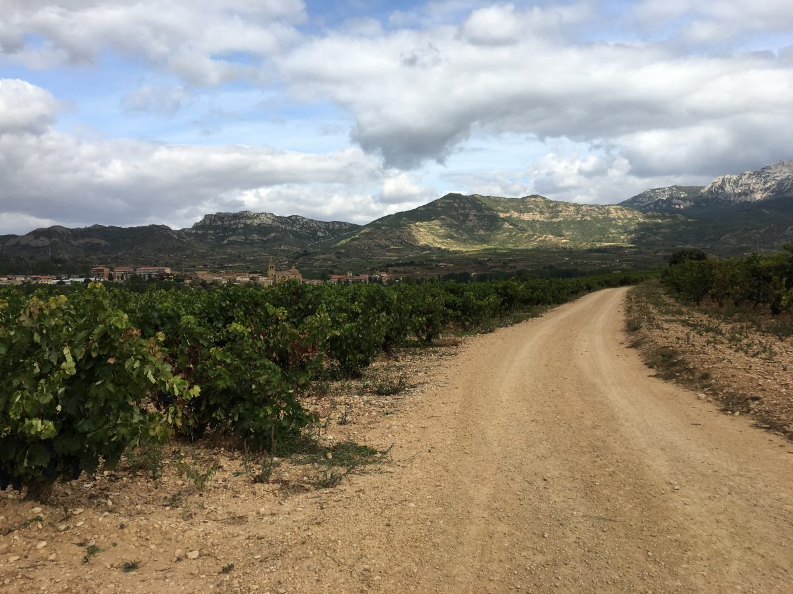
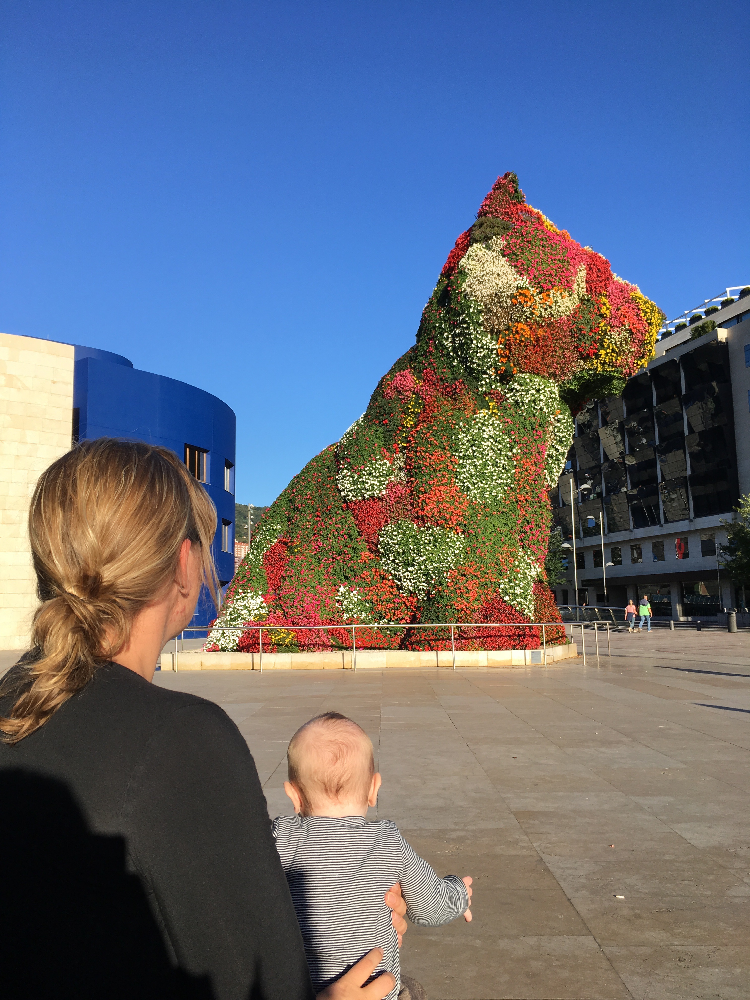

Wir haben sooo viel gesehen, tolle Eindrücke bekommen und sind daher kaum zum
Schreiben gekommen. Aber das wollen wir nun nachholen!

# Haro

Haro ist ein kleiner gemütlicher Ort, der sich herausputzt. Gerade auf dem Weg
zum Weinberg, wo die ganzen Bodegas ansässig sind, sieht man, dass der Ort sich
für die Touristen herausputzt. Man kann in kleinen ansässigen Bars in den
Bodegas Weinverkosten. Bodega- Hopping den ganzen lieben Tag betreiben. Wir
sind jedoch erstmal wandern gegangen. Gesa hat gemütlich auf meinem Rücken
geschlafen (Wer es noch nicht weiß, ein Kinderwagen war die größte
Fehlinvestition für dies Kind und sie wird daher nur von Mama und Papa im Tuch
oder in der Trage mit viel Körperwärme, Nähe und den Herzschlägen kuschelig
getragen.). Zu der Streckenlänge gibt es auf spanische Art unterschiedliche
Aussagen irgendwas um, zwischen, bei 6-8km ging es entlang des Ebro zwischen
den Weinreben. Auf dem Rückweg sind wir dann in einer Bodega eingekehrt und
haben die ersten Mitbringsel verkostet – für Christian mehr als für mich und
ich freue mich auf den Festtagswein zu Weihnachten!

# Ist das Kunst? - Bilbao

Auf Empfehlung von Rüdiger sind wir weiter nach Bilbao gezogen. Es stand Kultur
auf dem Plan: das Guggenheim Museum. Wir finden es immer wieder spannend und
damit auseinander zu setzen, zum Glück kann man ja darüber streiten. So kam es
uns auch in der Ausstellung von Joana Vasconcelos „I’m Your Mirror“ zu der
Frage: „Ist das Kunst oder kann das weg?”. Wer aus Asprin- und Valiumblistern
Stühle und Betten baut… wer’s mag… Umso besser konnten wir mit der Tannhäuser-
Sammlung „Von van Gogh bis Picasso“ was anfangen. So bald Kunst doch jedem
überlassen.

Abends ging es zum Campen an dem Atlantik, einschlafen, schlafen und aufwachen
zur Camperromatik des Meeresrauschens. Den kommenden Tag ging es getrieben von
der Neugierde und dem Ziel es bis Porto wenigstens zu schaffen weiter gen Süden
in die Nähe von Llane. Wir hatten wir einen wunderbaren
Hanglagen(!!!!)Stellplatz. Neben dem Meeresrauschen gab es zu dem, wie auf der
Alm, Kuhglockengeläut. Wo hat man schon mal so eine Erfahrung? Aufgrund der
sehr steilen Hanglage wird hier jeder Camper extra den aber rauf eskortiert
falls Abschlepphilfe benötigt wird.

# Tage am Atlantik

Kleiner Waschtag und freies Strampeln stand vor Santiago de Compostela in der
Nähe von Valdez an. Auch eine traumhafte Lage, jedoch -leider- nicht vom Vortag
zu übertoppen. Ein gemütlicher Tag für die Familie.

# Santiago de Compostela

Nach dem Trockenlegen von Stühlen, Gesas Strandmuschel nach der abgekühlten
Atlantiknacht und einem leckeren Frühstück ging es weiter nach Santiago de
Compostela. Der Nachmittag stand nur noch im Zeichen der Essensvorbereitung und
der Familienunterhaltung. Die Abende kommen wir nun dazu wieder mehr ab
zuschalten und auch mal ein Buch wieder zu lesen. Etwas, dass wir tatsächlich
gerade wieder lernen müssen. Wir haben es aber sooo genossen, wie man sieht an
der langen Zeit bis zu diesem Blogeintrag. Santiago, so finden wir, ist eine
etwas trübe Stadt. Man sieht vieler Orts zahlreiche Bettler. Zufall? Oder wie
im Brecht’s Dreigroschenoper kein Zufall, sondern ausnutzen der frommen Pilger?
Jedenfalls gibt es einem schönen Markt mit allem was man von den Felderm ernten
kann und aus dem  Meer bekommt. Ein kleiner Bummel, Kaffehausbesuch und der
Rundgang um die Kathedrale standen auf unser Tourliste. Morgens mussten wir
leider den Bus bemühen, weil es aus Eimern goss.

# Porto

Am Sonntag fuhren wir weiter nach Porto. Unsere Top3- Stadt zusammen mit
Stockholm und Barcelona. Danke an alle, die uns davon soooo vorschwärmten
(MaPa, Flori, Tiemo,…!). Es ging noch den Tag durch die Gassen von Gaia und auf
einen kleinen Snack an den Douro. Herzlichen lachten wir als die Erkenntnis kam
was Brava Patatas Grande sind. Wir dachten an Patas Bravas, wie man sie aus der
spanischen Küche kennt: frittierte Kartoffeln in Stücke mit Mayo und einer
schärferen Soße. Beim Bestellen wurde wir schon eines besser belehrt: „sowie
Chips“, okay, dann halt sowie Onkel Jam die bestem Chips ever in Polen gemacht,
dünne frittierte Kartoffelscheiben… Dem Lachkrampf über unsere Vorstellung und
die guten Völkervorteilem folgte auf das was kam: Eine Tüte Lays Chips! Achja…
davon werden wir noch lange lachend berichten. Es stand am Abend noch ein
Besuch vom Portweimmuseum und eine Portweinverkostung beim Weinkeller von
Cálem. Ein ausführliche Porto-Rundgang sollte am kommenden Tage folgen. Mit dem
Bus sind wir vom Atlantik auf der Seite von Gaia nach Porto rein gefahren.
Alleine das sollte man im Leben gemacht haben und dankbar um jeden Sitzplatz
sein. Jeder Ralleyfahrer fährt nicht schneller durch die kleinen Gassen mit
einem vollen Bus. Jede Minute zur Pause zählt dreifach zu zählen. Da gegen ist
die Fahrt mit der historischen Straßenbahn nur erwähnenswert, weil wir reizende
Engländer trafen. Mit ihrem britischen Humor wurde Gesa begutachtet und man
fand schnell Ähnlichkeiten: die Happy Socks! Rüstige Engländer tragen auch
Happy Socks und damit wurde das Geburtstagskind der Engländer aus dem
Mittelpunkt geschoben. Nein, so sollte es nicht bleiben und die ganze
Straßenbahn gratulierte mit einem Ständchen, der Bahnfahrer gratulierte mit
Hand schütteln. „Wenn einer eine Reise tut, da kann er was erzählen…“

# Langstrecke – oder wie wir nach Sahagún kamen

Die nächste Strecke sollte nur 250km lang sein… also rund 2,5 h fahren plus
Stillpausen. Jedoch zog es sich so in den Bergen zum Lago de Sanabria und der
Platz hatte temporär geschlossen. Der nächste existierte nicht mehr… jedoch ein
schöner See. Kurz essen, See genießen und leider weiter auf unser ungeplanten
Langstrecke, es standen noch mehr als 200 km vor uns. 

Die nächsten Plätze im Umkreis hatten schon geschlossen und so landeten wir
Sahagún. Nur noch essen und Füße hoch und den Entschluss fassen: „Morgen wird
nur Bob aufgeräumt, gewaschen und sonst nichts!“ So sollte es nach dem
Supermarktbesuch auch kommen. Gesa kam noch wieder unter die Dusche und wir
genossen den Tag so. Kurz vorm Schlafen gehen wies uns noch ein Motorradfahrer
darauf, dass es morgen regnen soll. Eigentlich suchte er jemanden, der sich mit
ihm eine Hütte teilte. Für uns kam jedoch der Hinweis zum Abbauen der Stühle
und des Tisches vorm Schlafen gehen und dem frühen Aufbrechen. Somit führen wir
dann heute im Regen nach Donastia- San Sebastian. Und unser Vordach wurde mal
wieder gelüftet.

Mehr die Tage aus der Nähe von Bordeaux, Nantes, Paris, Uden, Kölle? Wir werden
berichten!

Fühlt Euch gedrückt, bis bald!

Ines, Gesa und Christian
